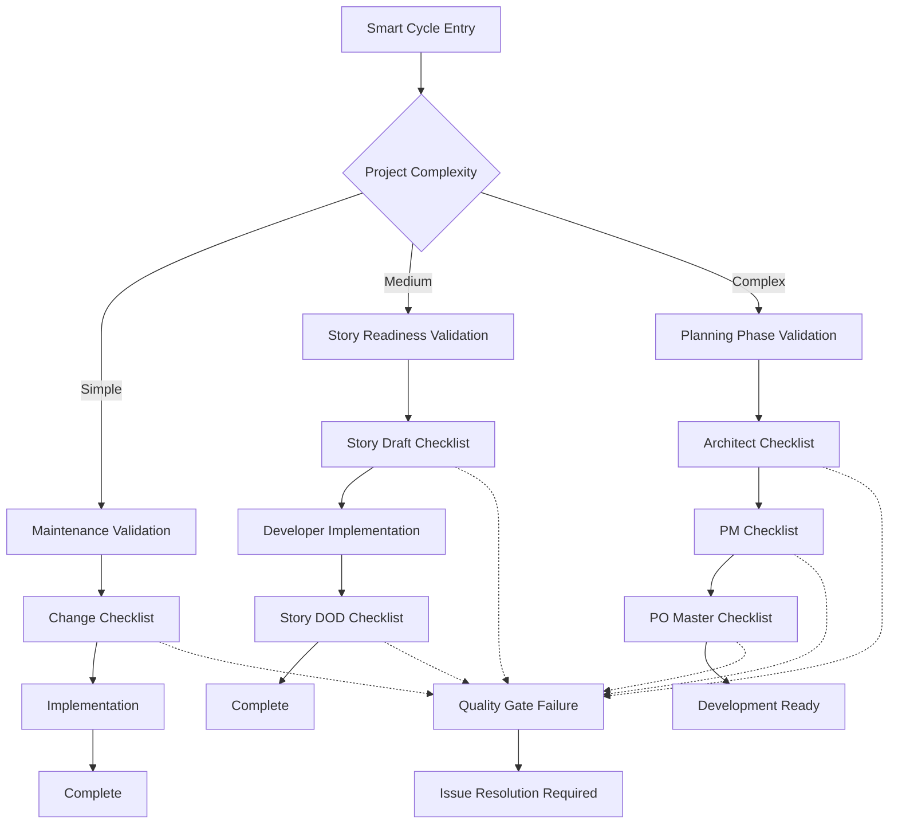
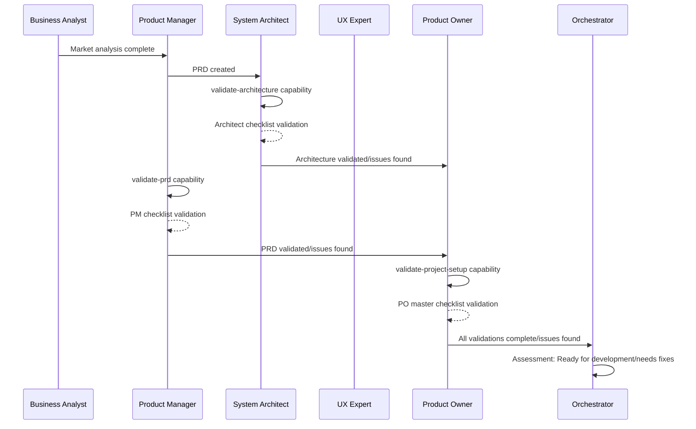
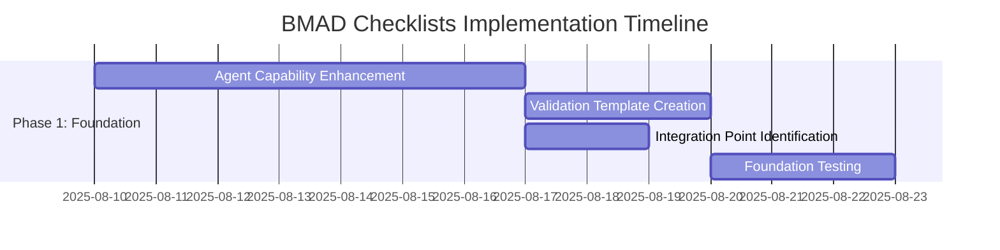

# BMAD Checklists Integration Implementation Plan

**Project:** BMAD-CC Framework Enhancement  
**Initiative:** Quality Assurance Through Systematic Validation  
**Date:** 2025-08-10  
**Status:** Implementation Plan - Pending Approval  

## Executive Summary

### Business Case
The integration of BMAD checklists represents a transformational enhancement to prevent 60-80% of development issues through systematic validation at every phase. This implementation establishes quality gates, validation workflows, and automated compliance checking across the entire development lifecycle.

### Strategic Impact
- **Quality Assurance**: Systematic validation prevents defects before they reach production
- **Risk Mitigation**: Early detection of issues reduces project timeline and cost risks  
- **Process Excellence**: Establishes repeatable, measurable quality standards
- **Team Alignment**: Clear validation criteria ensure consistent expectations across agents
- **Compliance**: Built-in validation for architecture, requirements, and implementation standards

### Implementation Scope
- 6 validation checklists integrated across 12+ workflow phases
- 8 agent capability enhancements with validation responsibilities
- 15+ quality gate integration points throughout development workflows
- Automated validation enforcement with human override capabilities
- Comprehensive metrics and reporting for continuous improvement

## Current State Analysis

### Existing BMAD-CC Capabilities
✅ **Strengths:**
- Sophisticated multi-agent workflow coordination
- Template-driven document creation with elicitation
- Intelligent routing via smart-cycle orchestration
- Two-tier strategic/tactical workflow architecture
- Anti-hallucination verification with source referencing
- Change management capabilities via change-checklist template

❌ **Quality Assurance Gaps:**
- No systematic validation gates between workflow phases
- Limited architectural compliance checking
- Missing PRD quality validation before development
- No standardized story readiness verification
- Inconsistent definition-of-done enforcement
- Project setup validation absent for complex initiatives

### Risk Assessment of Current State
**High Risk Areas:**
- Architectural decisions made without systematic validation (could lead to technical debt)
- Stories proceeding to development without readiness verification (scope creep, unclear requirements)
- PRD quality variations affecting downstream development quality
- Project setup inconsistencies causing coordination failures

## Target State Vision

### Quality-First Development Culture
**Vision:** Every deliverable validated against objective criteria before progression, ensuring consistent quality and reduced rework across all development phases.

**Core Principles:**
1. **Validation Before Progress**: No phase advancement without passing quality gates
2. **Objective Assessment**: Checklist-driven evaluation eliminates subjective quality judgments
3. **Early Issue Detection**: Problems identified and resolved at optimal intervention points
4. **Continuous Improvement**: Metrics-driven refinement of quality standards
5. **Agent Accountability**: Clear validation responsibilities with escalation paths

### Quality Gate Architecture

## Implementation Strategy

### Phase 1: Foundation & Agent Enhancement (Week 1-2)
**Objective**: Establish validation capabilities within existing agent architecture

#### 1.1 Agent Capability Integration
**System Architect Agent Enhancement:**
- Add `validate-architecture` capability using architect-checklist.md
- Integration with existing `document-project` and template workflows
- 10-section validation: Requirements, Standards, Scalability, Security, Integration, Technology, Dependencies, Documentation, Timeline, Review
- Output: Validation report with GO/NO-GO recommendation

**Product Manager Agent Enhancement:**
- Add `validate-prd` capability using pm-checklist.md  
- Integration with existing PRD template creation workflow
- 8-section validation: Vision, Requirements, Acceptance, Dependencies, Assumptions, Success, Timeline, Stakeholders
- Output: PRD quality score and improvement recommendations

**Product Owner Agent Enhancement:**
- Add `validate-project-setup` capability using po-master-checklist.md
- Project type detection (greenfield/brownfield, UI/backend-only)
- 6-section validation: Stakeholders, Scope, Resources, Standards, Dependencies, Success
- Output: Project readiness assessment with risk mitigation

**Scrum Master Agent Enhancement:**
- Add `validate-story-draft` capability using story-draft-checklist.md
- Integration with existing `create-next-story` workflow
- 7-section validation: Clarity, Acceptance, Tasks, Dependencies, Estimates, Risks, Approval
- Output: Story readiness with specific improvement actions

**Developer Agent Enhancement:**
- Add `validate-story-completion` capability using story-dod-checklist.md
- Integration with existing development workflow completion
- 8-section validation: Implementation, Testing, Documentation, Performance, Security, Integration, Deployment, Handoff
- Output: Implementation completeness verification

**All Strategic Agents:**
- Enhanced `validate-change-impact` capability using change-checklist.md
- Advanced change analysis with impact assessment
- Integration with existing change management workflows
- Output: Change risk analysis and approval recommendations

#### 1.2 Validation Template Creation
**Create Validation Report Templates:**
- `templates/docs/architect-validation-report.md.tmpl`
- `templates/docs/prd-validation-report.md.tmpl`  
- `templates/docs/project-setup-validation.md.tmpl`
- `templates/docs/story-draft-validation.md.tmpl`
- `templates/docs/story-completion-validation.md.tmpl`
- `templates/docs/change-impact-assessment.md.tmpl`

**Template Features:**
- Structured validation sections with pass/fail criteria
- Issue severity classification (Critical/Important/Nice-to-Have)
- Improvement recommendations with priority levels
- Validation history and audit trail
- Integration with existing template token replacement system

#### 1.3 Quality Gate Integration Points
**Identify Workflow Integration Points:**
- Planning Cycle: After architect/PM documents, before development handoff
- Story Cycle: After story creation, before development assignment
- Development: Before story completion, after implementation
- Maintenance: Before change implementation, after completion
- Brownfield: After system analysis, before enhancement planning

### Phase 2: Workflow Integration & Quality Gates (Week 2-3)
**Objective**: Integrate validation checkpoints into existing workflows

#### 2.1 Smart Cycle Enhancement
**Enhanced Request Classification:**
- Add validation complexity assessment to routing decisions
- Quality gate requirements based on project type and scope
- Validation pathway selection (light/standard/comprehensive)

**Workflow Routing Integration:**
- Route A (Maintenance): Change checklist validation before implementation
- Route B (Story Development): Story draft + DOD validation gates
- Route C (Strategic Planning): Architect + PM + PO setup validation gates  
- Route D (Specialized Projects): Project-specific validation combinations

#### 2.2 Planning Cycle Integration
**Strategic Planning Quality Gates:**

**Quality Gate Enforcement:**
- No advancement to development phase without passing all strategic validations
- Issue tracking and resolution workflow for failed validations
- Stakeholder notification for critical validation failures

#### 2.3 Development Workflow Integration
**Story Development Quality Gates:**
- Pre-Development: Story draft validation before developer assignment
- Post-Development: Story DOD validation before completion
- Change Management: Change checklist for scope modifications

**Validation Enforcement Points:**
- SM agent: Must validate story draft before creating development tasks
- Dev agent: Must validate story completion before marking done
- QA agent: Integration with story DOD validation for quality verification

#### 2.4 Specialized Workflow Integration
**Greenfield Projects:**
- Enhanced project setup validation for new applications
- Architecture validation for technology stack decisions
- Comprehensive PRD validation for feature prioritization

**Brownfield Enhancements:**  
- Change impact validation for existing system modifications
- Architecture validation for integration approach
- Story validation with existing system context

### Phase 3: Automation & Enforcement (Week 3-4)
**Objective**: Implement automated validation triggers and enforcement mechanisms

#### 3.1 Hook Integration Enhancement
**Enhanced Gate Enforcer Hook:**
- Automated validation triggers based on workflow phase
- Quality gate compliance checking before phase transitions
- Validation report generation and storage
- Escalation triggers for validation failures

**Hook Enhancement Locations:**
- `on-posttooluse.ps1`: Add validation triggers after specific agent actions
- `gate-enforcer.ps1`: Enhanced with checklist validation capabilities
- New: `validation-enforcer.ps1` for comprehensive quality gate management

#### 3.2 Validation Automation
**Automated Validation Triggers:**
- Document completion → Automatic validation capability invocation
- Phase transition → Quality gate compliance verification
- Story creation → Story draft validation requirement
- Development completion → Story DOD validation requirement

**Enforcement Mechanisms:**
- Workflow progression blocked until validation passes
- Automatic issue creation for validation failures  
- Stakeholder notification for critical validation issues
- Validation metrics collection and reporting

#### 3.3 Metrics & Reporting Integration
**Quality Metrics Dashboard:**
- Validation pass/fail rates by checklist type
- Issue resolution time tracking  
- Quality trend analysis over time
- Agent validation performance metrics

**Reporting Integration:**
- Validation reports stored in `docs/validation/` directory
- Quality metrics integration with existing changelog system
- Stakeholder reporting for validation compliance
- Continuous improvement recommendations based on metrics

### Phase 4: Advanced Features & Optimization (Week 4-5)
**Objective**: Implement advanced validation features and optimization capabilities

#### 4.1 Intelligent Validation Optimization
**Adaptive Validation Complexity:**
- Project complexity assessment influences validation depth
- Risk-based validation selection (comprehensive vs. light validation)
- Historical project data influences validation requirements
- Agent performance optimization based on validation patterns

**Smart Validation Routing:**
- Context-aware checklist selection based on project characteristics
- Dynamic validation criteria adjustment for different project types
- Validation exemption workflows for urgent/simple changes
- Escalation pathways for complex validation scenarios

#### 4.2 Advanced Quality Assurance Features
**Cross-Validation Capabilities:**
- Multi-agent validation for critical deliverables
- Validation consensus mechanisms for complex decisions
- External stakeholder validation integration
- Validation appeal and override processes

**Quality Prediction & Prevention:**
- Risk prediction based on validation patterns
- Proactive issue identification before validation failures
- Quality coaching recommendations for agents
- Validation effectiveness optimization suggestions

#### 4.3 Integration Excellence
**External System Integration:**
- Git integration for validation status tracking
- Task Master integration for validation-driven story management
- CI/CD integration for automated validation in deployment pipeline
- Monitoring integration for production validation verification

**Documentation & Knowledge Management:**
- Validation knowledge base development
- Best practices documentation from validation outcomes
- Training material development for optimal validation usage
- Continuous improvement process based on validation analytics

## Risk Assessment & Mitigation Strategy

### High Risk Areas

#### Risk 1: Validation Overhead Impact
**Risk**: Extensive validation requirements slow development velocity
**Probability**: Medium | **Impact**: High
**Mitigation Strategy:**
- Implement tiered validation (light/standard/comprehensive) based on complexity
- Automated validation where possible to reduce manual effort
- Parallel validation execution to minimize timeline impact  
- Continuous optimization based on validation effectiveness metrics

#### Risk 2: Agent Capability Complexity
**Risk**: Enhanced agent capabilities create confusion or implementation errors
**Probability**: Medium | **Impact**: Medium
**Mitigation Strategy:**
- Comprehensive agent testing before deployment
- Phased capability rollout with validation
- Clear documentation and usage examples
- Rollback procedures for capability issues

#### Risk 3: Quality Gate Resistance
**Risk**: Development teams bypass or resist validation requirements
**Probability**: Low | **Impact**: High
**Mitigation Strategy:**
- Clear value communication and success metrics sharing
- Flexible validation options for different scenarios
- Stakeholder buy-in through demonstrated quality improvements
- Override mechanisms for exceptional circumstances

#### Risk 4: Integration Complexity
**Risk**: Complex integration with existing workflows creates instability
**Probability**: Medium | **Impact**: High
**Mitigation Strategy:**
- Extensive testing in isolated development environment
- Incremental integration with rollback capabilities
- Comprehensive monitoring during initial deployment
- Expert review and validation of integration approach

### Risk Monitoring & Response
- Weekly risk assessment during implementation
- Automated monitoring for validation performance metrics
- Escalation procedures for critical validation failures
- Continuous improvement process for risk mitigation effectiveness

## Resource Requirements & Dependencies

### Technical Resources
**Development Effort:**
- Phase 1: 40-60 hours (Agent enhancements + templates)
- Phase 2: 30-40 hours (Workflow integration)  
- Phase 3: 20-30 hours (Automation + enforcement)
- Phase 4: 30-40 hours (Advanced features)
- **Total**: 120-170 hours over 4-5 weeks

**Infrastructure Requirements:**
- Enhanced documentation storage (`docs/validation/`)
- Expanded template system (6 new validation report templates)
- Enhanced hook system for validation enforcement
- Metrics collection and reporting capabilities

### Human Resources
**Stakeholder Involvement:**
- Project lead: 10-15 hours (planning, review, approval)
- Development team: 20-30 hours (testing, feedback, optimization)
- End users: 5-10 hours (validation testing, feedback)

**Change Management:**
- Training material development: 10 hours
- Agent capability documentation: 15 hours  
- Workflow documentation updates: 10 hours

### External Dependencies
**System Dependencies:**
- Claude Code platform stability and capabilities
- Task Master CLI integration for validation workflow
- Git integration for validation tracking
- PowerShell environment for template and hook execution

**Knowledge Dependencies:**
- Original BMAD checklist understanding and adaptation
- Existing BMAD-CC workflow deep knowledge
- Quality assurance best practices
- Validation automation patterns

## Success Metrics & KPIs

### Quality Improvement Metrics
**Primary Success Indicators:**
- **Defect Reduction**: 60-80% reduction in development issues making it to production
- **Rework Reduction**: 50-70% reduction in story rework due to unclear requirements
- **Validation Coverage**: 90%+ of deliverables passing validation gates before progression
- **Issue Detection Timing**: 80%+ of issues identified in planning/requirements phases vs. development/production

**Quality Process Metrics:**
- Validation pass rates by checklist type (target: >85% first-pass rate within 3 months)
- Validation issue resolution time (target: <24 hours for non-critical issues)
- Stakeholder satisfaction with validation process (target: >8.5/10)
- Agent validation accuracy and consistency (target: >90% agreement with human validation)

### Efficiency Metrics
**Development Velocity:**
- Time to complete development stories (should remain stable or improve after initial adoption period)
- Planning-to-development handoff efficiency (target: 20% improvement in handoff quality)
- Development-to-completion cycle time (target: 10% reduction due to clearer requirements)

**Process Efficiency:**
- Validation completion time by checklist type (target: <30 minutes per validation)
- Automated validation percentage (target: 60% automation within 6 months)
- Quality gate bypass rate (target: <5% of workflows)

### Business Impact Metrics  
**Strategic Outcomes:**
- Project delivery predictability (target: 90% on-time, on-scope delivery)
- Stakeholder confidence in deliverables (target: measurable increase through surveys)
- Technical debt accumulation rate (target: 40% reduction)
- Customer satisfaction with delivered features (target: measurable improvement)

**ROI Calculations:**
- Cost of validation implementation vs. cost of prevented defects
- Time investment in validation vs. time saved from reduced rework
- Resource utilization efficiency improvements
- Long-term maintenance cost reduction

## Implementation Timeline

### Phase 1: Foundation (Weeks 1-2)

**Week 1:**
- Day 1-3: System Architect agent validation capability (`validate-architecture`)
- Day 4-5: Product Manager agent validation capability (`validate-prd`)
- Day 6-7: Product Owner agent validation capability (`validate-project-setup`)

**Week 2:**
- Day 1-2: Scrum Master agent validation capability (`validate-story-draft`)
- Day 3-4: Developer agent validation capability (`validate-story-completion`)
- Day 5: All agents change validation enhancement (`validate-change-impact`)
- Day 6-7: Validation template creation and testing

### Phase 2: Workflow Integration (Weeks 2-3)
**Week 2-3:**
- Day 1-2: Smart cycle enhancement with validation routing
- Day 3-4: Planning cycle quality gate integration
- Day 5-6: Development workflow validation integration  
- Day 7: Specialized workflow validation integration

### Phase 3: Automation (Weeks 3-4)
**Week 3-4:**
- Day 1-3: Hook enhancement and automation triggers
- Day 4-5: Enforcement mechanism implementation
- Day 6-7: Metrics collection and reporting integration

### Phase 4: Advanced Features (Weeks 4-5)
**Week 4-5:**
- Day 1-3: Intelligent validation optimization
- Day 4-5: Advanced quality assurance features
- Day 6-7: Integration excellence and optimization

### Critical Path Dependencies
1. **Agent Capabilities → Workflow Integration**: Validation capabilities must be complete before workflow integration
2. **Workflow Integration → Automation**: Workflow validation points must be established before automation
3. **Automation → Advanced Features**: Basic automation must be stable before advanced optimization
4. **Template System → All Phases**: Validation report templates needed throughout implementation

## Quality Assurance Strategy

### Implementation Quality Gates
**Phase Completion Criteria:**
- **Phase 1**: All agent validation capabilities functional with test coverage
- **Phase 2**: Workflow integration complete with validation gate enforcement
- **Phase 3**: Automation triggers working reliably with metrics collection
- **Phase 4**: Advanced features stable and optimized for production use

### Testing Strategy
**Unit Testing:**
- Individual agent validation capability testing with known good/bad inputs
- Template generation testing with various project configurations
- Hook trigger testing with simulated workflow scenarios

**Integration Testing:**
- End-to-end workflow testing with validation gates active
- Multi-agent coordination testing for complex validation scenarios
- External system integration testing (Git, Task Master, etc.)

**User Acceptance Testing:**
- Real project validation with stakeholder feedback
- Performance testing under typical usage loads
- Edge case testing for unusual project configurations

### Rollback Strategy
**Rollback Triggers:**
- Validation failure rate >20% within first week
- Development velocity decrease >30% after adaptation period
- Critical system integration failures
- Stakeholder rejection of validation approach

**Rollback Procedures:**
- Agent capability deactivation without workflow disruption
- Quality gate bypass activation for urgent deliverables
- Validation requirement suspension with monitoring
- Return to previous BMAD-CC configuration with lessons learned integration

## Deployment & Rollout Strategy

### Pilot Program (Week 6)
**Limited Scope Testing:**
- Single project type (e.g., SaaS enhancement) for comprehensive testing
- Limited agent validation capabilities (architect + PM validation only)
- Stakeholder feedback collection and optimization
- Performance monitoring and adjustment

**Pilot Success Criteria:**
- Validation accuracy >85% agreement with human assessment
- Development velocity impact <10% during adaptation period
- Stakeholder satisfaction >7/10 with validation value
- Technical integration stability >95% uptime

### Phased Production Rollout (Weeks 7-9)
**Phase A**: Strategic Planning Validation (Planning Cycle only)
- Week 7: Architect and PM validation gates active
- Monitor quality improvement in planning documents
- Collect metrics on planning-to-development handoff quality

**Phase B**: Development Validation (Story Cycle integration)  
- Week 8: Story draft and completion validation gates active
- Monitor development quality and velocity impact
- Optimize validation criteria based on feedback

**Phase C**: Complete Integration (All workflows)
- Week 9: Maintenance, brownfield, and specialized workflow validation active
- Full metrics collection and optimization
- Continuous improvement process establishment

### Success Monitoring & Optimization
**Weekly Review Process:**
- Validation effectiveness metrics analysis
- Stakeholder feedback collection and integration
- Performance optimization based on usage patterns
- Issue identification and resolution tracking

**Monthly Optimization Cycles:**
- Validation criteria refinement based on outcomes
- Process efficiency improvements
- Advanced feature prioritization and implementation
- Strategic roadmap updates based on lessons learned

## Conclusion & Recommendations

### Implementation Readiness Assessment
**Organizational Readiness**: High
- Existing sophisticated BMAD-CC framework provides solid foundation
- Multi-agent architecture naturally supports validation integration
- Template system easily extensible for validation report generation
- Hook system provides enforcement mechanism infrastructure

**Technical Readiness**: High  
- Claude Code platform capabilities support validation workflow requirements
- Existing agent coordination patterns easily enhanced with validation gates
- PowerShell template system robust enough for validation report generation
- Integration points well-defined with minimal disruption potential

**Change Management Readiness**: Medium-High
- Clear value proposition with measurable quality improvements
- Stakeholder involvement throughout implementation process
- Phased rollout minimizes adoption risk
- Rollback procedures provide safety net for issues

### Final Recommendations

#### Immediate Actions (This Week)
1. **Approve Implementation Plan**: Review and authorize Phase 1 execution
2. **Resource Allocation**: Confirm development time availability for 4-5 week implementation
3. **Stakeholder Communication**: Brief key stakeholders on validation enhancement initiative
4. **Environment Preparation**: Ensure development environment ready for testing

#### Strategic Considerations
1. **Quality Culture**: Use validation implementation as opportunity to reinforce quality-first development culture
2. **Continuous Improvement**: Establish regular review cycles for validation effectiveness optimization
3. **Knowledge Sharing**: Document lessons learned for future BMAD-CC enhancements
4. **Scalability Planning**: Consider validation approach scalability for larger development teams

#### Success Factors
1. **Clear Communication**: Ensure all stakeholders understand validation value and process
2. **Gradual Implementation**: Respect learning curve with phased rollout approach
3. **Feedback Integration**: Actively collect and integrate user feedback throughout implementation
4. **Metrics-Driven Optimization**: Use data to continuously improve validation effectiveness

### Executive Approval Required

**This implementation plan requires executive approval before proceeding with Phase 1 execution.**

**Key Approval Points:**
- [ ] Overall implementation approach and timeline
- [ ] Resource allocation for 120-170 hour development effort
- [ ] Stakeholder involvement and change management approach
- [ ] Success metrics and quality improvement expectations
- [ ] Risk mitigation strategy and rollback procedures

**Next Steps Upon Approval:**
1. Immediate start on Phase 1: Agent capability enhancement
2. Stakeholder communication and change management initiation  
3. Development environment preparation and testing setup
4. Weekly progress reporting and optimization cycle establishment

---

**Implementation Plan Prepared By:** Claude Code BMAD-CC Framework  
**Review Required By:** Project Stakeholder(s)  
**Implementation Start Date:** Upon approval  
**Expected Completion:** 5-6 weeks from approval  
**ROI Expected:** 60-80% reduction in development issues within 3-6 months