# BMAD-CC: Business Model Accelerated Development for Claude Code

**Transform Claude Code into an Enterprise Development Platform**

[](CHANGELOG.md)
[](LICENSE)
[](https://claude.ai/code)
[](https://docker.com)
[](https://npmjs.com/package/task-master-ai)

## 🎯 What is BMAD-CC?

BMAD-CC is a comprehensive framework that transforms Claude Code into an enterprise-grade development platform. It provides **strategic intelligence** alongside tactical execution through:

- **12 Specialized AI Agents** - Each an expert in their domain
- **Intelligent Workflow Orchestration** - Routes work based on complexity
- **Comprehensive Quality Gates** - Prevents 60-80% of common issues
- **No-Fallback Policy** - Enforces real implementations, no dummy data
- **Vibe CEO Philosophy** - You lead strategically, agents execute tactically

## 🚀 Quick Start

### One-Line Installation

```powershell
# Windows PowerShell
powershell -ExecutionPolicy Bypass -NoProfile -Command "iwr https://raw.githubusercontent.com/stacksup/BMAD-CC/main/bootstrap.ps1 -UseBasicParsing | iex; Install-BMAD -ProjectDir . -ProjectType auto"
```

### Start Your First Workflow

```bash
# In Claude Code
/bmad:smart-cycle
```

That's it! The intelligent orchestrator will guide you through the rest.

**📖 Full Installation Guide**: [docs/INSTALLATION.md](docs/INSTALLATION.md)

## 🏗️ How It Works

### Intelligent Workflow Routing

The Smart Cycle analyzes your request and routes it to the optimal workflow:

```mermaid
flowchart TD
    A[Your Request] --> B[Smart Cycle Analysis]
    B --> C{Complexity Assessment}
    
    C -->|Bug Fix<br/>< 4 hours| D[🔧 Maintenance Cycle]
    C -->|Feature<br/>4-40 hours| E[💻 Development Cycle]
    C -->|Complex<br/>> 40 hours| F[📋 Planning Cycle]
    C -->|New Project| G[🌱 Greenfield Workflow]
    C -->|Enhancement| H[🏗️ Brownfield Workflow]
    
    style B fill:#e1f5fe
    style D fill:#fff3e0
    style E fill:#f3e5f5
    style F fill:#e8f5e9
    style G fill:#fff8e1
    style H fill:#fce4ec
```



### Development Workflow

Every feature follows a structured development process:


**📖 Detailed Workflows**: [docs/WORKFLOWS-GUIDE.md](docs/WORKFLOWS-GUIDE.md)

## 👥 Your AI Team

### Strategic Planning Agents
- **🔍 Business Analyst** - Market research, competitive analysis
- **📊 Product Manager** - Product strategy, PRD creation
- **🏛️ System Architect** - Technical design, architecture
- **🎨 UX Expert** - User experience, interface design

### Development Execution Agents
- **🏃 Scrum Master** - Story creation, sprint planning
- **👤 Product Owner** - Requirements, acceptance criteria
- **💻 Developer** - Implementation (with no-fallback policy)
- **✅ QA Engineer** - Testing, code review, quality gates

### Support Agents
- **📝 Documentation** - Automated docs, changelogs
- **🎓 Learnings** - Knowledge extraction, best practices
- **🔀 Git Manager** - Version control, deployments

**📖 Complete Agent Guide**: [docs/AGENTS-GUIDE.md](docs/AGENTS-GUIDE.md)

## ✨ Key Features

### 🧠 Advanced Elicitation & Brainstorming
- 20+ brainstorming techniques for creative solutions
- Advanced elicitation methods for requirements gathering
- Interactive refinement with Tree of Thoughts, SCAMPER, Five Whys
- Say "brainstorm" or "clarify" in any workflow

**📖 Elicitation Guide**: [docs/ELICITATION-GUIDE.md](docs/ELICITATION-GUIDE.md)

### 🚫 No-Fallback Policy
- **NEVER** dummy data or mock implementations in production
- **ALWAYS** real data connections and explicit error handling
- Enforced at multiple levels: agents, code review, automated hooks

**📖 Policy Details**: [docs/no-fallback-policy.md](docs/no-fallback-policy.md)

### 📋 Comprehensive Quality Gates
- Architecture validation (10 sections, min 8/10)
- PRD validation (8 sections, min 8/10)
- Story readiness (8 sections, min 7/10)
- Story completion (8 sections, min 9/10)

**📖 Quality Guide**: [docs/QUALITY-GATES.md](docs/QUALITY-GATES.md)

### 🐳 Docker-First Development
- All development in containers
- Consistent environments
- Service health monitoring
- Integrated Docker commands

**📖 Docker Guide**: [docs/DOCKER-GUIDE.md](docs/DOCKER-GUIDE.md)

### 📊 Task Master Integration
- Automatic task tracking
- Progress visibility
- Sprint management
- Git commit linking

**📖 Task Master Guide**: [docs/TASKMASTER-GUIDE.md](docs/TASKMASTER-GUIDE.md)

## 📚 Documentation

### Getting Started
- **[Installation Guide](docs/INSTALLATION.md)** - Detailed setup instructions
- **[Documentation Map](docs/DOCUMENTATION-MAP.md)** - Navigate all docs
- **[Architecture Overview](docs/ARCHITECTURE.md)** - System design

### Guides
- **[Agents Guide](docs/AGENTS-GUIDE.md)** - All agents explained
- **[Workflows Guide](docs/WORKFLOWS-GUIDE.md)** - Detailed workflows
- **[Customization Guide](docs/CUSTOMIZATION-GUIDE.md)** - Personalization

### Reference
- **[Troubleshooting](docs/TROUBLESHOOTING.md)** - Common issues
- **[Contributing](docs/CONTRIBUTING.md)** - How to contribute
- **[Changelog](CHANGELOG.md)** - Version history

## 🎯 Use Cases

### ✅ Perfect For
- SaaS application development
- Mobile app development
- Game development (Phaser)
- API and microservices
- Full-stack web applications
- Brownfield enhancements
- Greenfield projects

### 💡 Example Scenarios

**Quick Bug Fix** (Maintenance Cycle)
```
"Login validation errors don't show properly"
→ Smart Cycle → Maintenance → Fixed in 30 minutes
```

**New Feature** (Development Cycle)
```
"Add user profile with avatar upload"
→ Smart Cycle → Story Cycle → Complete feature with tests
```

**Major Initiative** (Planning Cycle)
```
"Build mobile app version of our platform"
→ Smart Cycle → Planning → Full strategic plan → Development
```

## 🚀 What's New in v3.0

### 🎯 Complete Framework Transformation (3-Phase Implementation)

**Phase 1: Enhanced Strategic Intelligence**
- **Interactive Elicitation** - 9-option enhancement menus for deeper requirement gathering
- **Story Validation System** - Anti-hallucination verification with scoring
- **AI Frontend Generation** - Integration with v0, Lovable, Cursor for rapid UI development

**Phase 2: Scale & Complexity Mastery**  
- **Document Sharding** - Automatic handling of large documents (>5MB) with navigation
- **Brownfield Analysis** - Comprehensive existing system documentation and enhancement
- **Intelligent Project Detection** - Auto-detects project characteristics and activates features

**Phase 3: Quality & Process Automation**
- **Automated Quality Gates** - Validation enforcement at every workflow transition
- **Comprehensive Change Management** - Systematic scope change handling with impact assessment
- **Process Automation** - Self-improving system with validation feedback loops

**📖 Full Changelog**: [CHANGELOG.md](CHANGELOG.md)

## 🤝 Contributing

We welcome contributions! Please see our [Contributing Guide](docs/CONTRIBUTING.md) for details.

### Quick Contribution Tips
- Fork and create feature branches
- Keep PRs focused (200-400 lines ideal)
- Follow the no-fallback policy
- Add tests for new features
- Update documentation

## 📞 Support

- **Documentation**: [docs/DOCUMENTATION-MAP.md](docs/DOCUMENTATION-MAP.md)
- **Issues**: [GitHub Issues](https://github.com/stacksup/BMAD-CC/issues)
- **Community**: [GitHub Discussions](https://github.com/stacksup/BMAD-CC/discussions)
- **Updates**: Watch this repo for updates

## 📄 License

MIT License - see [LICENSE](LICENSE) file for details.

---

<div align="center">

**Built with ❤️ by the BMAD Community**

*Transform your Claude Code into an enterprise development platform today!*

[Get Started](docs/INSTALLATION.md) • [View Docs](docs/DOCUMENTATION-MAP.md) • [Report Issue](https://github.com/stacksup/BMAD-CC/issues)

</div>