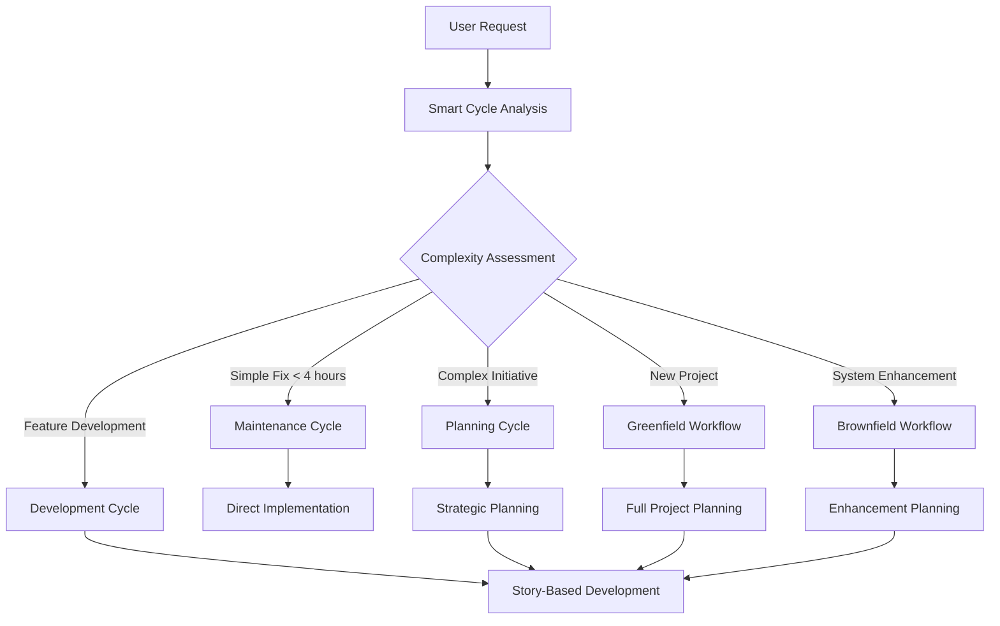
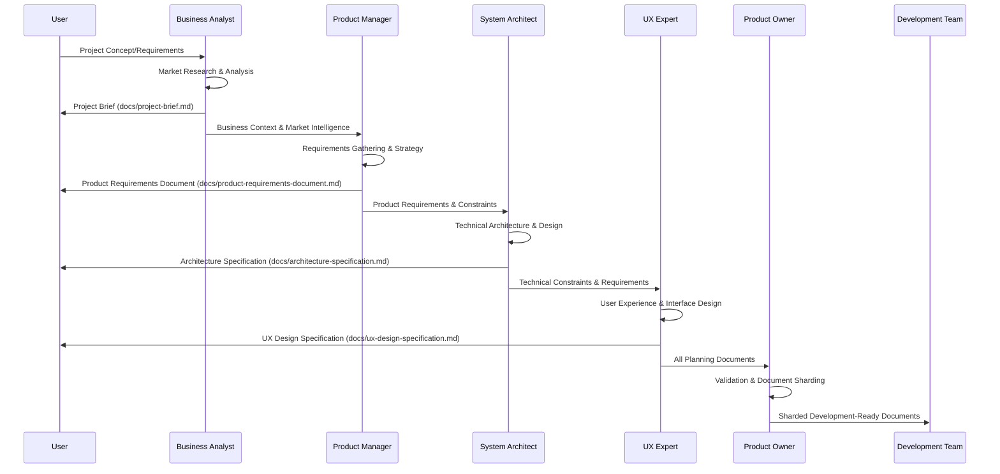
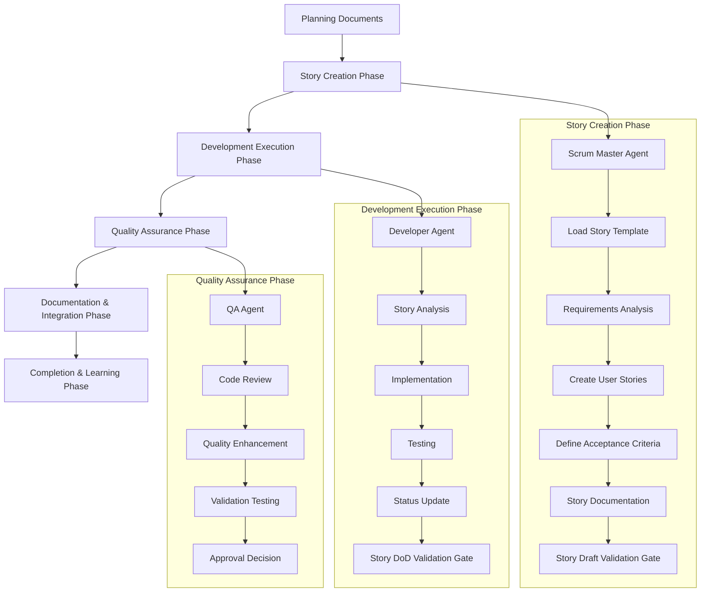
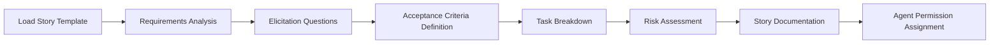
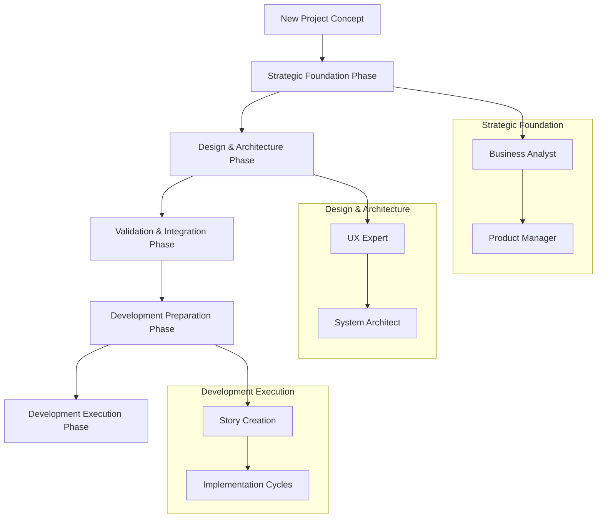
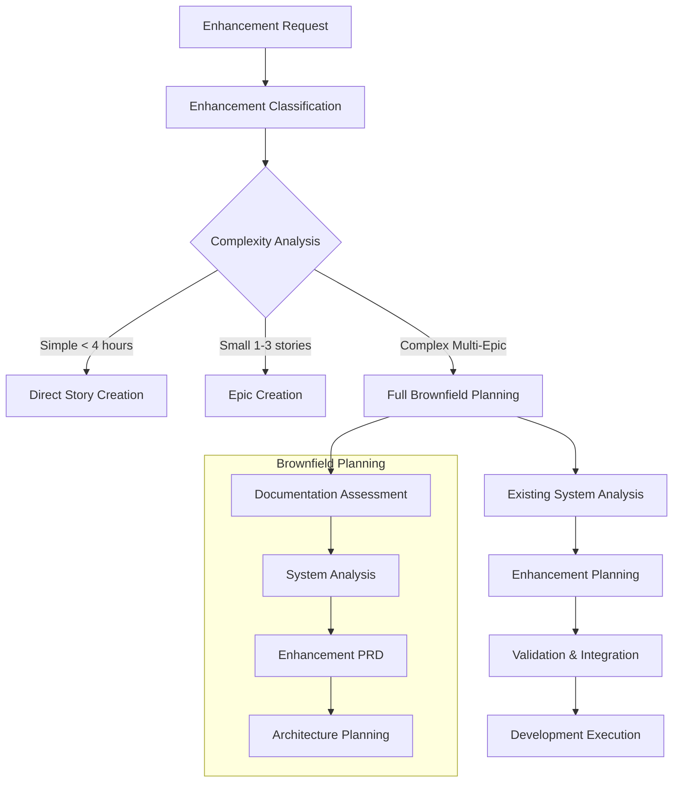
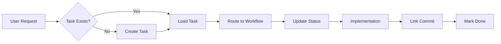

# BMAD-CC: Business Model Accelerated Development for Claude Code

**Version:** 2.1.0  
**Author:** AI-Assisted Framework Development  
**Last Updated:** December 19, 2024  
**License:** MIT  

## 🚀 What's New in v2.1

### Major Enhancements
- **Task Master AI Integration** - Now an absolute requirement with automatic initialization
- **GitHub Auto-Backup** - Automatic code backup after every task completion
- **Docker-First Development** - All development happens in containers for consistency
- **Comprehensive Documentation** - Automatic CHANGELOG, README, and story documentation
- **Agent Color System** - Visual distinction for all agents without manual configuration
- **Validation Checklists** - 5 comprehensive validation gates for quality assurance

## Overview

BMAD-CC is a sophisticated project management and development framework specifically designed for Claude Code. It transforms the original BMAD (Business Model Accelerated Development) concept into a comprehensive system that leverages Claude Code's agents, slash commands, hooks, and programmability features to deliver enterprise-grade project execution.

Unlike traditional development workflows that focus primarily on coding tasks, BMAD-CC provides **strategic intelligence** alongside tactical execution, ensuring that what gets built has real business value, market fit, and technical excellence.

## Core Philosophy

### Strategic-First Development
BMAD-CC operates on the principle that successful software projects require strategic thinking **before** tactical execution. Every significant development effort begins with business analysis, market research, product strategy, and architectural planning.

### Intelligent Workflow Orchestration
The framework uses AI-powered classification to route work through appropriate workflows based on complexity, scope, and business impact. Simple fixes bypass strategic planning, while complex initiatives receive comprehensive analysis.

### Template-Driven Documentation
Professional-grade document creation using structured templates ensures consistency, completeness, and quality across all project artifacts. Each strategic agent creates documents that meet enterprise standards.

### Agent-Centric Execution
Claude Code agents act as specialized team members, each with defined roles, responsibilities, and decision-making authority. This creates a coordinated team approach to project execution.

## Framework Architecture

### Two-Tier Workflow System

BMAD-CC operates on a two-tier workflow system designed to match work complexity with appropriate process depth:

#### Tier 1: Strategic Planning Workflows
For complex initiatives requiring comprehensive analysis and planning:
- **Planning Cycle**: Full strategic analysis and documentation
- **Greenfield Full-stack**: New project development with complete planning
- **Brownfield Enhancement**: Existing system enhancements with integration analysis

#### Tier 2: Tactical Development Workflows  
For implementation and maintenance tasks:
- **Development Cycles**: Story-based development execution
- **Maintenance Cycle**: Quick fixes and small improvements
- **Story Cycles**: Feature development within established projects

### Intelligent Routing System

The **Smart Cycle** (`/bmad:smart-cycle`) acts as the entry point, using AI classification to route work appropriately:



## Major Workflows Deep Dive

### 1. Planning Cycle Workflow

The Planning Cycle represents the **strategic intelligence layer** of BMAD-CC. This workflow transforms high-level business ideas into actionable development plans through systematic analysis and professional documentation.

#### Workflow Structure



#### Phase-by-Phase Breakdown

**Phase 1: Business Analysis Foundation**
- **Agent**: Business Analyst (`analyst-agent`)
- **Template**: `docs/templates/project-brief.md.tmpl`
- **Process**: 
  1. Load elicitation framework (`docs/templates/elicitation-framework.md.tmpl`)
  2. Conduct systematic stakeholder interviews using structured questions
  3. Perform market research using WebSearch and WebFetch tools
  4. Analyze competitive landscape and positioning opportunities
  5. Create comprehensive project brief with business context, market analysis, user personas, and risk assessment
- **Output**: `docs/project-brief.md`
- **Success Criteria**: Clear business case, validated market opportunity, defined success metrics

**Phase 2: Product Strategy & Requirements**
- **Agent**: Product Manager (`pm-agent`)  
- **Template**: `docs/templates/product-requirements-document.md.tmpl`
- **Process**:
  1. Review project brief for business context and constraints
  2. Conduct detailed requirements elicitation with stakeholders
  3. Define product vision, strategy, and success metrics
  4. Create detailed user stories with acceptance criteria
  5. Prioritize features and plan release roadmap
  6. Document functional and non-functional requirements
- **Output**: `docs/product-requirements-document.md`
- **Success Criteria**: Complete PRD with actionable requirements, clear prioritization, measurable success criteria

**Phase 3: Technical Architecture Planning**
- **Agent**: System Architect (`architect-agent`)
- **Template**: `docs/templates/architecture-specification.md.tmpl`
- **Process**:
  1. Analyze PRD for technical requirements and constraints
  2. Research technology options and industry best practices
  3. Design system architecture and component relationships
  4. Define technology stack with detailed rationale
  5. Plan data architecture, API design, and security approach
  6. Create deployment and scalability strategy
- **Output**: `docs/architecture-specification.md`
- **Success Criteria**: Complete technical blueprint enabling efficient development

**Phase 4: User Experience Design**
- **Agent**: UX Expert (`ux-agent`)
- **Template**: `docs/templates/ux-design-specification.md.tmpl`
- **Process**:
  1. Review PRD and architecture for design constraints
  2. Conduct user research and competitive design analysis
  3. Create information architecture and user workflows
  4. Design interface specifications and interaction patterns
  5. Define design system and visual standards
  6. Plan responsive design and accessibility compliance
- **Output**: `docs/ux-design-specification.md`
- **Success Criteria**: Complete UX specification enabling intuitive user experience

**Phase 5: Validation & Development Preparation**
- **Agent**: Product Owner (`po-agent`)
- **Process**:
  1. Cross-validate all planning documents for consistency
  2. Verify business objectives align with technical architecture
  3. Confirm UX design supports product vision
  4. Identify and resolve any conflicts or gaps
  5. Shard documents into development-consumable pieces
  6. Prepare transition to development workflows
- **Output**: Validated planning suite + sharded documents in `docs/prd/` and `docs/architecture/`
- **Success Criteria**: Development-ready documentation with validated requirements

#### Claude Code Integration Points

**Agents & Tools**:
- Each planning agent has specific tool permissions (WebSearch, WebFetch, Read, Write, Edit)
- Agents use structured templates and elicitation frameworks
- Template token replacement system provides project-specific customization

**Slash Commands**:
- `/bmad:planning-cycle` - Initiates full strategic planning workflow
- Each phase can be invoked individually for iterative refinement

**Hooks & Automation**:
- `on-posttooluse.ps1` - Automatically tracks document creation and updates
- Quality gates enforce validation before proceeding to next phase

### 2. Development Cycle Workflows

The Development Cycle represents the **tactical execution layer** where planning transforms into working software. This encompasses multiple specialized workflows optimized for different development scenarios.

#### Core Development Workflow Structure



#### Development Workflow Types

**1. Story Cycle (`/bmad:story-cycle`)**
- **Purpose**: Standard feature development within established projects
- **Entry Point**: Existing project with established architecture and patterns
- **Process Flow**: SM → PO → Dev → QA → Doc → Learnings → Git
- **Characteristics**: 
  - Works from existing PRD and architecture documentation
  - Focuses on incremental feature development
  - Emphasizes consistency with established patterns
  - Typical duration: 4-40 hours per story

**2. SaaS Cycle (`/bmad:saas-cycle`)**
- **Purpose**: SaaS-specific development with backend/frontend coordination
- **Entry Point**: SaaS projects requiring coordinated full-stack development
- **Process Flow**: Enhanced story cycle with SaaS-specific considerations
- **Characteristics**:
  - Docker/container integration and health checks
  - API-first development approach
  - Database migration and data consistency focus
  - Multi-tenant architecture considerations

**3. Maintenance Cycle (`/bmad:maintenance-cycle`)**
- **Purpose**: Quick fixes, bug resolution, and minor improvements
- **Entry Point**: Issues requiring < 4 hours of work
- **Process Flow**: Dev → Optional QA → Doc → Git
- **Characteristics**:
  - Streamlined for efficiency
  - Minimal overhead for small changes
  - Focus on rapid resolution without breaking existing functionality
  - Escalation triggers for scope creep

#### Detailed Development Process

**Story Creation Phase (Scrum Master Agent)**



**Process Details**:
1. **Template Loading**: Read `docs/templates/story-template.md.tmpl`
2. **Requirements Analysis**: Review PRD sections and architecture specs
3. **Interactive Elicitation**: Use structured questions to define scope
4. **Acceptance Criteria**: Create Given-When-Then scenarios
5. **Task Breakdown**: Identify specific implementation steps
6. **Agent Permissions**: Assign ownership and approval authority
7. **Documentation**: Create complete story in `docs/story-notes/`

**Development Execution Phase (Developer Agent)**

**Agent Responsibilities**:
- **Primary**: Full implementation responsibility with code quality focus
- **Permissions**: Read/Write/Execute on codebase
- **Deliverables**: Working implementation with comprehensive testing
- **Standards**: Follow existing patterns, maintain consistency

**Implementation Process**:
1. **Story Analysis**: Understand requirements and acceptance criteria
2. **Architecture Alignment**: Ensure implementation follows established patterns
3. **Incremental Development**: Build in testable, reviewable increments
4. **Testing Strategy**: Implement unit, integration, and validation tests
5. **Documentation**: Update code comments and implementation notes
6. **Status Management**: Update story status through development lifecycle

**Quality Assurance Phase (QA Engineer Agent)**

**Agent Responsibilities**:
- **Role**: Senior review and mentorship with quality enforcement
- **Permissions**: Read/Review/Approve with escalation authority
- **Focus**: Code quality, performance, security, and best practices

**QA Process**:
1. **Code Review**: Senior-level review with educational feedback
2. **Quality Enhancement**: Identify and guide improvements
3. **Testing Validation**: Ensure comprehensive test coverage
4. **Performance Assessment**: Validate performance requirements
5. **Approval Decision**: 
   - **QA_APPROVED**: Story meets quality standards
   - **NEEDS_DEV_WORK**: Return with specific feedback

#### Development Workflow Integration

**With Planning Workflows**:
- Development workflows consume documents from planning workflows
- Sharded PRD and architecture specs provide focused context
- Story creation references strategic documents for context

**Agent Coordination**:
- Each agent has defined handoff points and deliverables
- Status tracking ensures visibility across the development process
- Quality gates prevent progression without meeting standards

**Claude Code Programmability**:
- **Slash Commands**: Each development workflow has dedicated command
- **Agent Tools**: Development agents have full codebase access with Read, Write, Edit, Bash tools
- **Hooks**: Automated quality checking and progress tracking
- **Settings**: Project-specific configuration and tool permissions

## Specialized Workflows

### Greenfield Full-stack Workflow (`/bmad:greenfield-fullstack`)

**Purpose**: Complete new application development from concept to implementation

**Integration Approach**: Combines Planning Cycle with Development Cycle execution



**Key Features**:
- **AI-Generated UI Integration**: Optional AI UI generation for modern frontend foundations
- **Full-Stack Coordination**: Balanced frontend/backend development planning
- **Enterprise Standards**: Comprehensive documentation and quality standards
- **Scalability Planning**: Architecture designed for growth and maintenance

### Brownfield Enhancement Workflow (`/bmad:brownfield-enhancement`)

**Purpose**: Safe enhancement of existing systems with integration planning

**Classification System**:
- **Single Story Enhancement** (< 4 hours): Direct to story creation
- **Small Feature Enhancement** (1-3 stories): Epic creation with focused planning  
- **Major Enhancement** (Multiple epics): Full brownfield planning workflow



**Safety Features**:
- **System Integration Analysis**: Understanding existing architecture and constraints
- **Backward Compatibility Planning**: Ensuring existing functionality remains intact
- **Risk Mitigation**: Comprehensive risk assessment and rollback planning
- **Incremental Deployment**: Feature flags and safe rollout strategies

## Agent System Deep Dive

### Strategic Agents (Planning-Focused)

#### Business Analyst Agent (`analyst-agent`)
- **Role**: Market intelligence and business foundation
- **Tools**: WebSearch, WebFetch, Read, Write, Edit (for research capabilities)
- **Template**: Project Brief with market analysis and competitive intelligence
- **Process**: Interactive elicitation → Market research → Business case development
- **Deliverable**: Comprehensive business foundation with validated market opportunity

#### Product Manager Agent (`pm-agent`)  
- **Role**: Product strategy and requirements specification
- **Tools**: Read, Write, Edit (for document creation and analysis)
- **Template**: Product Requirements Document with user stories and roadmap
- **Process**: Stakeholder elicitation → Requirements analysis → Prioritization and planning
- **Deliverable**: Complete PRD with actionable requirements and success metrics

#### System Architect Agent (`architect-agent`)
- **Role**: Technical architecture and implementation planning  
- **Tools**: Read, Write, Edit (for architecture documentation)
- **Template**: Architecture Specification with technology decisions and system design
- **Process**: Requirements analysis → Technology research → Architecture design and documentation
- **Deliverable**: Technical blueprint enabling efficient and scalable development

#### UX Expert Agent (`ux-agent`)
- **Role**: User experience design and interface planning
- **Tools**: Read, Write, Edit (for design documentation)  
- **Template**: UX Design Specification with user workflows and design system
- **Process**: User research → Design strategy → Interface specification and standards
- **Deliverable**: Complete UX specification ensuring intuitive user experience

### Tactical Agents (Development-Focused)

#### Scrum Master Agent (`sm-agent`)
- **Role**: Story creation and development coordination
- **Tools**: Read, Write, Edit (for story documentation)
- **Template**: Story Template with agent permissions and acceptance criteria
- **Process**: Requirements analysis → Story breakdown → Task definition and documentation
- **Deliverable**: Development-ready stories with clear acceptance criteria

#### Developer Agent (`dev-agent`)  
- **Role**: Implementation and technical execution
- **Tools**: Full development toolkit (Read, Write, Edit, Bash, Glob, Grep)
- **Process**: Story analysis → Implementation → Testing → Documentation
- **Authority**: Primary implementation responsibility with code quality ownership

#### QA Engineer Agent (`qa-agent`)
- **Role**: Quality assurance and senior mentorship
- **Tools**: Read, Edit, Bash (for code review and testing)
- **Process**: Code review → Quality enhancement → Testing validation → Approval decision
- **Authority**: Quality gate enforcement with approval/rejection power

#### Product Owner Agent (`po-agent`)
- **Role**: Validation, acceptance, and coordination
- **Tools**: Read, Write, Edit (for validation and coordination)
- **Process**: Requirements validation → Cross-document consistency → Development coordination
- **Authority**: Final acceptance and sign-off responsibility

### Agent Permission Framework

**Template-Defined Permissions**: Each story created from template defines specific agent permissions:

```markdown
### Agent Permissions & Ownership

### Primary Agent: Developer Agent
**Permissions:** Read/Write/Execute
- Full implementation responsibility

### Secondary Agent: QA Engineer Agent  
**Permissions:** Read/Review/Approve
- Quality assurance and approval authority

### Supporting Agent: Product Owner Agent
**Permissions:** Read/Validate/Accept
- Final acceptance and sign-off
```

**Escalation Hierarchy**:
1. **Developer Agent**: Implementation decisions within story scope
2. **QA Engineer Agent**: Quality and architecture decisions
3. **Product Owner Agent**: Requirements and acceptance decisions
4. **Strategic Agents**: Architectural or product strategy escalations

## Claude Code Integration Architecture

### Slash Command System

**Entry Points**:
- `/bmad:smart-cycle` - Intelligent workflow routing and classification
- `/bmad:planning-cycle` - Strategic planning for complex initiatives  
- `/bmad:story-cycle` - Standard development workflow
- `/bmad:saas-cycle` - SaaS-specific development workflow
- `/bmad:maintenance-cycle` - Quick fixes and improvements
- `/bmad:greenfield-fullstack` - New project development
- `/bmad:brownfield-enhancement` - Existing system enhancements

**Command Structure**:
Each slash command is a Claude Code workflow file (`.md` format) containing:
- Workflow description and allowed tools
- Phase-by-phase execution instructions  
- Agent loading and coordination logic
- Quality gates and validation checkpoints
- Success criteria and completion requirements

### Hook System Integration

**Post-Tool-Use Hook (`on-posttooluse.ps1`)**:
- Automatically tracks document creation and updates
- Maintains project state and progress visibility
- Triggers quality validation and consistency checks
- Integrates with external tools (Git, Task Master, Docker)

**Gate Enforcer Hook (`gate-enforcer.ps1`)**:
- Enforces quality gates between workflow phases
- Validates document completeness before progression
- Ensures agent permissions and approval requirements
- Prevents invalid state transitions

**Validation Enforcer Hook (`validation-enforcer.ps1`)** *[NEW]*:
- Systematic validation using BMAD checklists
- Quality gate enforcement with minimum score requirements
- Automated validation triggers at phase transitions
- Validation status reporting and metrics tracking

### Template and Token System

**Template Structure**:
```
templates/
├── .claude/
│   ├── agents/           # Agent persona and capability definitions
│   ├── commands/bmad/    # Workflow slash commands
│   └── hooks/           # Automation and validation hooks
├── docs/                # Document templates for strategic planning
└── root/               # Project-level configuration templates
```

**Token Replacement System**:
- `{{PROJECT_NAME}}` - Dynamic project naming
- `{{PROJECT_TYPE}}` - saas, phaser, mobile, other
- `{{PRD_PATH}}` - Requirements document location
- `{{FRONTEND_DIR}}`, `{{BACKEND_DIR}}` - Project structure
- `{{DOCKER_COMPOSE_FILE}}` - Container configuration

**Installation Process**:
```powershell
# PowerShell installation with automatic detection
powershell -ExecutionPolicy Bypass -NoProfile -Command "
  iwr https://raw.githubusercontent.com/YOUR-USERNAME/bmad-cc/main/bootstrap.ps1 -UseBasicParsing | 
  iex; Install-BMAD -ProjectDir . -ProjectType auto"
```

## Usage Examples

### Example 1: Strategic Initiative - Mobile App Development

**Scenario**: "We want to build a mobile app version of our web application"

**Smart Cycle Classification**: Complex Initiative → Planning Cycle

**Process Flow**:
1. **Business Analyst**: Market research for mobile apps, competitive analysis, user needs assessment
2. **Product Manager**: Mobile-specific PRD with platform considerations, app store requirements
3. **System Architect**: Mobile architecture with API design, offline capabilities, performance optimization
4. **UX Expert**: Mobile-first design with touch interactions, responsive patterns, accessibility
5. **Product Owner**: Validation and preparation for mobile development cycles

**Outcome**: Complete mobile strategy with development-ready documentation

### Example 2: Feature Development - User Profile System

**Scenario**: "Add a user profile page with avatar upload and account settings"

**Smart Cycle Classification**: Feature Development → Story Cycle

**Process Flow**:
1. **Scrum Master**: Story creation from existing PRD, acceptance criteria definition
2. **Developer**: Frontend/backend implementation, file upload handling, validation
3. **QA Engineer**: Security review, performance testing, user experience validation
4. **Documentation**: Update API docs, user guides, system documentation

**Outcome**: Production-ready user profile system with comprehensive testing

### Example 3: Quick Fix - Validation Bug

**Scenario**: "There's a bug in the login form where validation errors don't show properly"

**Smart Cycle Classification**: Maintenance Request → Maintenance Cycle

**Process Flow**:
1. **Developer**: Issue analysis, root cause identification, minimal fix implementation
2. **Optional QA**: Review if security-sensitive or high-risk
3. **Documentation**: Update changelog, capture lessons learned
4. **Git**: Commit with clear description and deploy

**Outcome**: Rapid bug resolution with minimal overhead

## Quality Assurance & Validation System

### Overview
BMAD-CC includes a comprehensive validation system that enforces quality standards through systematic checklists at every phase of development. This system prevents 60-80% of common development issues through early detection and validation.

### Validation Checklists

**Architecture Validation** (`architect-checklist.md`):
- 10-section comprehensive review of system architecture
- Validates requirements alignment, standards compliance, scalability, security
- Minimum score: 8/10 for approval
- Triggers: After architecture creation, before major changes

**PRD Validation** (`pm-checklist.md`):
- 8-section review of product requirements documents
- Validates vision clarity, requirements completeness, acceptance criteria
- Minimum score: 8/10 for approval
- Triggers: After PRD completion, before development handoff

**Project Setup Validation** (`po-master-checklist.md`):
- 6-section review with auto-detection of project type
- Validates stakeholder alignment, resources, technical standards
- Minimum score: 7/10 for ready status
- Triggers: At project kickoff, during major scope changes

**Story Draft Validation** (`story-draft-checklist.md`):
- 8-section review of story readiness for development
- Validates clarity, acceptance criteria, technical readiness, tasks
- Minimum score: 7/10 for ready status
- Triggers: Before sprint planning, before developer assignment

**Story Completion Validation** (`story-dod-checklist.md`):
- 8-section Definition of Done review
- Validates implementation, testing, documentation, security
- Minimum score: 9/10 for done status
- Triggers: Before marking story complete, before deployment

### Validation Workflow

```mermaid
flowchart TD
    A[Work Item Created] --> B{Item Type?}
    
    B -->|Architecture| C[Architecture Validation]
    B -->|PRD| D[PRD Validation]
    B -->|Project| E[Project Setup Validation]
    B -->|Story| F[Story Draft Validation]
    
    C --> G{Score ≥ 8/10?}
    D --> H{Score ≥ 8/10?}
    E --> I{Score ≥ 7/10?}
    F --> J{Score ≥ 7/10?}
    
    G -->|Yes| K[Approved - Proceed]
    G -->|No| L[Fix Issues & Revalidate]
    
    H -->|Yes| K
    H -->|No| L
    
    I -->|Yes| K
    I -->|No| L
    
    J -->|Yes| M[Development]
    J -->|No| L
    
    M --> N[Story DoD Validation]
    N --> O{Score ≥ 9/10?}
    O -->|Yes| P[Complete]
    O -->|No| Q[Fix & Revalidate]
```



### Agent Validation Capabilities

Each strategic agent has enhanced validation capabilities:

- **System Architect**: `validate-architecture` capability
- **Product Manager**: `validate-prd` capability
- **Product Owner**: `validate-project-setup` and `validate-change-impact` capabilities
- **Scrum Master**: `validate-story-draft` capability
- **Developer**: `validate-story-completion` capability

### Validation Reports

All validation reports are saved to `docs/validation/` with standardized naming:
- `architect-validation-[date].md`
- `prd-validation-[date].md`
- `project-setup-[date].md`
- `story-draft-[epic.story]-[date].md`
- `story-dod-[epic.story]-[date].md`

### Quality Gates

Quality gates are enforced at critical workflow transitions:
- Planning → Development: Architecture and PRD must pass validation
- Story Creation → Development: Story draft must pass validation
- Development → Completion: Story DoD must pass validation
- Project Start: Project setup must pass validation

### Validation Metrics

The system tracks key quality metrics:
- Validation pass/fail rates by checklist type
- Average validation scores by phase
- Time to resolve validation issues
- Rework reduction percentage
- Defect prevention rate

## Task Master AI Integration (REQUIRED)

### Overview
BMAD-CC **requires** Task Master AI as the single source of truth for all development work. Every task, feature, and bug fix must be tracked through Task Master to ensure complete project visibility and systematic execution.

### Task Master Features Used
- **PRD Parsing**: Automatically converts requirements documents into actionable tasks
- **Task Expansion**: Breaks complex tasks into manageable subtasks
- **Status Tracking**: Maintains accurate task status (todo → in-progress → done)
- **Velocity Metrics**: Tracks development speed and progress
- **Git Integration**: Links commits and PRs to specific tasks

### Automatic Initialization
When you run `/bmad:smart-cycle` on a new project:
1. **Checks for Task Master** - Exits with error if not installed
2. **Initializes project** - Runs `task-master init` if needed
3. **Parses existing PRD** - Looks for requirements in multiple locations:
   - Configured `PRD_PATH` from setup
   - `CLAUDE.md` in project root
   - `requirements.md` or `docs/prd.md`
   - Requirements section in `README.md`
4. **Creates initial tasks** - Either from PRD or from your first request

### Task-Driven Workflow


## Docker Container Integration (REQUIRED)

### Overview
BMAD-CC assumes all development happens inside Docker containers. This ensures consistency, isolation, and reproducibility across all environments. Every command executed by agents runs inside containers, not on the host machine.

### Docker-First Development Philosophy
- **No Host Dependencies**: Never install packages on the host machine
- **Container Isolation**: Each service runs in its own container
- **Hot Reloading**: Code changes reflect immediately through volume mounts
- **Health Monitoring**: Automatic container health checks before operations
- **Production Parity**: Development containers mirror production environment

### Automatic Docker Management
The framework includes comprehensive Docker management through:

#### Docker Manager Hook (`docker-manager.ps1`)
- **Automatic startup**: Containers start when workflows begin
- **Health monitoring**: Validates all services are running properly
- **Troubleshooting**: Diagnoses and fixes common container issues
- **Resource cleanup**: Manages disk space and removes unused images

#### Docker Command (`/bmad:docker`)
Quick container management without leaving Claude:
```bash
/bmad:docker  # Start containers and check health
```

### Development Workflow with Docker

#### All Commands Run in Containers
```bash
# Instead of running on host:
npm install package  # ❌ Don't do this

# Run inside container:
docker-compose exec backend npm install package  # ✅ Do this
```

#### Typical Development Session
```bash
# 1. Start your work (containers auto-start)
/bmad:smart-cycle

# 2. Development happens in containers
docker-compose exec backend npm test
docker-compose exec frontend npm run build

# 3. View logs while working
docker-compose logs -f

# 4. Containers stop when done
docker-compose down
```

### Docker Compose Configuration
Projects should include `docker-compose.yml` with:
- Service definitions for all components (frontend, backend, database)
- Volume mounts for hot reloading
- Health checks for service readiness
- Network configuration for inter-service communication

Example structure:
```yaml
services:
  frontend:
    build: ./frontend
    volumes:
      - ./frontend:/app
      - /app/node_modules
    ports:
      - "3000:3000"
      
  backend:
    build: ./backend
    volumes:
      - ./backend:/app
      - /app/node_modules
    ports:
      - "8001:8001"
    depends_on:
      - db
      
  db:
    image: postgres:15
    environment:
      POSTGRES_DB: projectname
    volumes:
      - postgres_data:/var/lib/postgresql/data
```

### Container Health Validation
Before any operation, the system verifies:
- Docker daemon is running
- All required containers are healthy
- Services respond on expected ports
- No critical errors in container logs

### Docker MCP Commands
When Docker MCP is installed, additional commands become available:
- `mcp__docker__list_containers` - List all containers with status
- `mcp__docker__get_container_logs` - View container logs
- `mcp__docker__execute_command` - Run commands in containers
- `mcp__docker__get_container_stats` - Monitor resource usage

## Getting Started

### Prerequisites
- Claude Code CLI installed and configured
- **Task Master AI** (REQUIRED): `npm install -g task-master-ai`
- **Docker Desktop** (REQUIRED): All development happens in containers
  - Download from: https://www.docker.com/products/docker-desktop
  - Ensures consistent development environment across all team members
  - Prevents "works on my machine" issues through containerization
- **Docker MCP** (Recommended): Enhanced container management in Claude
  - Install from: https://github.com/ciac/mcp-docker
  - Provides `mcp__docker__*` commands for container interaction
- PowerShell (Windows) or PowerShell Core (cross-platform)
- Git repository for your project
- Internet access for template and framework installation

### Installation

1. **Navigate to your project directory**:
   ```bash
   cd your-project-directory
   ```

2. **Install BMAD-CC framework**:
   ```powershell
   powershell -ExecutionPolicy Bypass -NoProfile -Command "
     iwr https://raw.githubusercontent.com/YOUR-USERNAME/bmad-cc/main/bootstrap.ps1 -UseBasicParsing | 
     iex; Install-BMAD -ProjectDir . -ProjectType auto"
   ```

3. **Restart Claude Code to load new configuration**:
   ```bash
   claude --restart
   ```

4. **Verify installation**:
   ```bash
   /settings
   # Check that bmad commands are available
   /bmad:smart-cycle --help
   ```

### First Usage

#### For New Projects (No Task Master)
1. **Initialize Task Master**:
   ```bash
   /bmad:init-taskmaster
   ```
   This automatically:
   - Installs Task Master if needed
   - Initializes project with `task-master init`
   - Parses any existing PRD/requirements into tasks
   - Creates initial setup tasks if no PRD exists

2. **Start development**:
   ```bash
   /bmad:smart-cycle
   ```
   The system will get the next task and route to appropriate workflow

#### For Existing Projects (Already Using Task Master)
1. **Just start working**:
   ```bash
   /bmad:smart-cycle  # Picks up from existing task backlog
   ```

2. **Or work on specific task**:
   ```bash
   task-master show 23  # View task details
   /bmad:taskmaster-workflow  # Work on it
   ```

#### Daily Workflow
```bash
# Monday: Parse new requirements
task-master parse-prd --input=new-features.md --force

# Daily: Just run this one command
/bmad:smart-cycle  # Gets next task, implements, updates status, commits

# Check progress anytime
task-master stats
task-master list --with-subtasks
```

### Project Structure After Installation

```
your-project/
├── .claude/
│   ├── agents/              # AI agent definitions
│   ├── commands/bmad/       # Workflow slash commands  
│   ├── hooks/              # Automation hooks
│   └── settings.local.json  # Claude Code configuration
├── docs/
│   ├── templates/          # Document templates
│   ├── lessons/           # Learning capture
│   └── story-notes/       # Development stories
├── CLAUDE.md              # Project context for AI
└── CHANGELOG.md           # Change tracking
```

## Key Features of BMAD-CC v2.1

### 🤖 Intelligent Agent System
- **12 Specialized Agents** - Each with unique role, tools, and color
- **Automatic Color Assignment** - Visual distinction without manual configuration
- **Role-Based Permissions** - Agents have specific tool access and decision authority
- **Enhanced Capabilities** - Validation, documentation, Docker integration

### 📋 Task Master AI Integration
- **Mandatory Requirement** - Framework won't function without Task Master
- **Automatic Initialization** - Sets up Task Master for new projects
- **PRD Parsing** - Converts requirements into actionable tasks
- **Status Tracking** - Real-time task progress throughout workflows
- **Git Integration** - Links commits and PRs to specific tasks

### 🐳 Docker-First Development
- **Container Isolation** - All development happens in Docker containers
- **Automatic Management** - Containers start/stop with workflows
- **Health Monitoring** - Validates services before operations
- **Template Generation** - Creates Docker configs based on project type
- **Docker MCP Support** - Enhanced container management commands

### 📚 Comprehensive Documentation
- **Automatic Updates** - Documentation updates with every task
- **CHANGELOG Generation** - Semantic versioning with categorized changes
- **Story Documentation** - Captures implementation details and decisions
- **Smart Detection** - Identifies what docs need updating from git changes
- **Health Checks** - Periodic validation of documentation completeness

### 🔄 GitHub Integration
- **Auto-Backup** - Pushes code after task completion
- **Dynamic User Detection** - Works with any authenticated GitHub user
- **PR Creation** - Automated pull request generation with gh CLI
- **Commit Linking** - Associates commits with Task Master tasks

### ✅ Validation System
- **5 Checkpoint Types** - Architecture, PRD, Project, Story Draft, Story DoD
- **Quality Gates** - Minimum scores required to proceed
- **Automated Enforcement** - Validation at workflow transitions
- **Detailed Reports** - Saved validation results with scores

### 🎯 Workflow Orchestration
- **Smart Routing** - AI classifies work and routes to optimal workflow
- **Phase Management** - Clear phases with quality gates
- **Agent Coordination** - Seamless handoffs between specialists
- **Progress Tracking** - Real-time visibility of workflow status

## Framework Evolution

### Current Status: Version 2.1.0
- ✅ Intelligent workflow routing and classification
- ✅ Professional template-based document creation
- ✅ Strategic planning workflow with market intelligence
- ✅ Development execution workflows with quality gates
- ✅ Agent permission framework and coordination
- ✅ Claude Code integration with slash commands and hooks

### Planned Enhancements: Version 2.1
- 🔄 Enhanced story review and approval workflows
- 🔄 Epic retrospective and learning capture automation
- 🔄 Advanced project metrics and progress tracking
- 🔄 Integration with external project management tools
- 🔄 Customizable workflow templates for industry verticals

### Long-term Vision: Version 3.0
- 🎯 Multi-project portfolio management
- 🎯 Cross-project learning and pattern recognition
- 🎯 Automated code generation from specifications
- 🎯 Advanced AI-powered quality assurance
- 🎯 Enterprise deployment and governance features

## Contributing

BMAD-CC is designed as an extensible framework. Contributions are welcome in several areas:

### Workflow Extensions
- Industry-specific workflow templates
- Platform-specific development patterns
- Integration with specialized tools and services

### Agent Enhancements  
- Additional agent personas and specializations
- Enhanced elicitation frameworks and question sets
- Improved decision-making and classification logic

### Template Library
- Document templates for specific industries or project types
- Enhanced interactive elicitation capabilities
- Multi-language and localization support

### Integration Improvements
- Enhanced Claude Code programmability features
- Better external tool integration
- Advanced automation and quality gates

## License

MIT License - see LICENSE file for details.

## Support and Community

- **Issues**: Report bugs and request features via GitHub Issues
- **Discussions**: Join framework discussions and share experiences
- **Documentation**: Comprehensive guides and examples in `/docs`
- **Updates**: Framework evolution and improvement announcements

---

*BMAD-CC represents a new paradigm in AI-assisted software development, combining strategic intelligence with tactical excellence to deliver software that truly serves business objectives and user needs.*