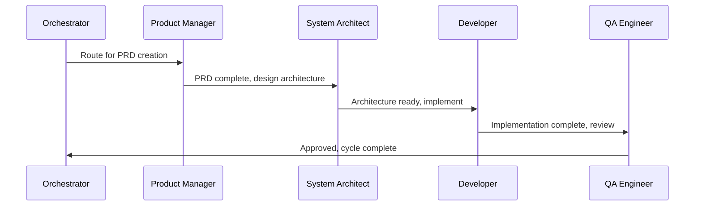

# BMAD-CC Agents Guide

## Overview

BMAD-CC employs 12 specialized AI agents, each representing a specific role in the software development lifecycle. Agents are loaded through Claude Code's agent system and operate with defined personas, capabilities, and responsibilities.

## Agent Categories

### Strategic Planning Agents
These agents focus on high-level planning, analysis, and design before implementation begins.

### Development Execution Agents
These agents handle the tactical execution of development tasks, from story creation to implementation.

### Support & Utility Agents
These agents provide specialized support functions like documentation, learning extraction, and version control.

### Meta Orchestration Agent
The orchestrator coordinates multi-agent workflows and makes routing decisions.

---

## Strategic Planning Agents

### Business Analyst Agent
**Command**: `/analyst-agent`  
**Color**: Blue  
**Purpose**: Market research, competitive analysis, and business requirements gathering

**Core Responsibilities**:
- Conduct market research and competitive analysis
- Identify business opportunities and user needs
- Create business cases and ROI projections
- Analyze industry trends and best practices
- Validate business assumptions with data

**Key Capabilities**:
- Market sizing and forecasting
- SWOT and Porter's Five Forces analysis
- Customer journey mapping
- Statistical analysis and data visualization
- Stakeholder analysis and requirements elicitation

**Elicitation Methods**:
- Stakeholder Round Table for multiple perspectives
- Risk identification for market threats
- Innovation Tournament for opportunity comparison
- What If scenarios for market exploration

**Outputs**:
- Market analysis reports (`docs/market-analysis.md`)
- Competitive analysis documents
- Business requirements specifications
- User research findings
- Strategic recommendations

---

### Product Manager Agent
**Command**: `/pm-agent`  
**Color**: Yellow  
**Purpose**: Product strategy, feature prioritization, and PRD ownership

**Core Responsibilities**:
- Define product vision and strategy
- Create comprehensive Product Requirements Documents
- Prioritize features based on impact and effort
- Manage product roadmap and release planning
- Ensure product-market fit

**Key Capabilities**:
- PRD creation with advanced elicitation
- Feature prioritization frameworks
- User story mapping
- Success metrics definition
- Stakeholder alignment

**Validation Capability**:
- `validate-prd`: 8-section checklist validation
- Minimum score: 8/10 for approval
- Outputs validation report to `docs/validation/`

**Brainstorming Techniques**:
- SCAMPER method for feature variations
- Six Thinking Hats for multi-perspective evaluation
- Tree of Thoughts for complex feature decomposition
- "Yes, And..." building for iterative refinement

**Outputs**:
- Product Requirements Documents (`docs/prd.md`)
- Product strategy documents
- Feature prioritization matrices
- Release plans and roadmaps
- Success metrics dashboards

---

### System Architect Agent
**Command**: `/architect-agent`  
**Color**: Indigo  
**Purpose**: Technical architecture, system design, and technology decisions

**Core Responsibilities**:
- Design system architecture and technical specifications
- Make technology selection decisions
- Define API specifications and service boundaries
- Plan data architecture and database design
- Ensure scalability, security, and performance

**Key Capabilities**:
- Architecture specification creation
- Technology evaluation and selection
- API and service design
- Performance and scalability planning
- Security architecture design

**No-Fallback Design Principle**:
- Enforces explicit failure modes in all designs
- Requires observable system states
- Prohibits silent degradation patterns
- Mandates error propagation through layers

**Validation Capability**:
- `validate-architecture`: 10-section checklist
- Minimum score: 8/10 for approval
- Covers standards, scalability, security

**Outputs**:
- Technical architecture documents (`docs/technical-architecture.md`)
- API specifications
- Database schemas
- Technology decision records
- Security design documents

---

### UX Expert Agent
**Command**: `/ux-agent`  
**Color**: Purple  
**Purpose**: User experience design, interface planning, and usability

**Core Responsibilities**:
- Design user experiences and journeys
- Create interface specifications and wireframes
- Develop design systems and visual standards
- Ensure accessibility and usability
- Conduct user research and testing

**Key Capabilities**:
- User journey mapping
- Wireframe and prototype creation
- Design system development
- Accessibility assessment
- Usability testing planning

**Outputs**:
- UX design specifications (`docs/ux-design-spec.md`)
- User journey maps
- Wireframes and mockups
- Design system documentation
- Usability test plans

---

## Development Execution Agents

### Scrum Master Agent
**Command**: `/sm-agent`  
**Color**: Green  
**Purpose**: Sprint planning, story creation, and agile process management

**Core Responsibilities**:
- Create user stories from requirements
- Facilitate sprint planning and estimation
- Track sprint progress and velocity
- Remove impediments and blockers
- Ensure agile best practices

**Key Capabilities**:
- Story creation from PRD/epics
- Sprint planning and backlog management
- Velocity tracking and forecasting
- Impediment identification and resolution
- Team coordination and facilitation

**Story Validation**:
- `validate-story-draft`: 8-section checklist
- Minimum score: 7/10 for ready status
- Ensures development readiness

**Task Master Integration**:
- Creates stories linked to Task Master tasks
- Updates task status throughout sprint
- Tracks completion and velocity

**Outputs**:
- User stories (`docs/stories/`)
- Sprint plans
- Velocity reports
- Impediment logs
- Sprint retrospectives

---

### Product Owner Agent
**Command**: `/po-agent`  
**Color**: Magenta  
**Purpose**: Requirements refinement, acceptance criteria, and stakeholder alignment

**Core Responsibilities**:
- Refine and validate requirements
- Define acceptance criteria
- Prioritize backlog items
- Validate delivered features
- Manage stakeholder expectations

**Key Capabilities**:
- Requirements validation and refinement
- Acceptance criteria definition
- Change impact analysis
- Stakeholder communication
- Release planning

**Validation Capabilities**:
- `validate-project-setup`: 6-section checklist
- `validate-change-impact`: Change assessment
- Master checklist for comprehensive review

**Outputs**:
- Refined requirements
- Acceptance criteria
- Change impact assessments
- Stakeholder communications
- Release notes

---

### Developer Agent
**Command**: `/dev-agent`  
**Color**: Red  
**Purpose**: Code implementation, debugging, and technical problem-solving

**Core Responsibilities**:
- Implement features according to requirements
- Write clean, maintainable code
- Ensure proper testing coverage
- Handle error conditions explicitly
- Optimize for performance and security

**No-Dummy-Data Policy**:
- **NEVER** implement fallback or dummy data
- **NEVER** hide failures behind fake success
- **ALWAYS** use real data connections
- **ALWAYS** let errors propagate visibly

**Docker Development**:
- All development happens in containers
- Uses docker-compose for services
- Maintains container health checks
- Implements proper logging

**Task Master Integration**:
- Links commits to tasks
- Updates task status during development
- Documents implementation details

**Outputs**:
- Production code
- Unit tests
- Integration tests
- Technical documentation
- Performance optimizations

---

### QA Engineer Agent
**Command**: `/qa-agent`  
**Color**: Orange  
**Purpose**: Quality assurance, code review, and testing

**Core Responsibilities**:
- Conduct comprehensive code reviews
- Design and execute test strategies
- Identify and prevent quality issues
- Mentor team on best practices
- Validate against acceptance criteria

**Dummy Data Detection**:
- Actively searches for fallback patterns
- Scans for mock data in production code
- Validates error handling is explicit
- Automatic rejection for violations

**Senior Review Approach**:
- Reviews as senior mentoring junior
- Fixes issues with explanations
- Shares best practices
- Prevents future occurrences

**Story Validation**:
- `validate-story-completion`: DoD checklist
- Minimum score: 9/10 for done status
- Comprehensive 8-section review

**Outputs**:
- Code review feedback
- Test plans and results
- Quality metrics
- Bug reports
- Performance assessments

---

## Support & Utility Agents

### Documentation Agent
**Command**: `/doc-agent`  
**Color**: Cyan  
**Purpose**: Documentation creation and maintenance

**Core Responsibilities**:
- Update project documentation
- Create API documentation
- Maintain README files
- Document architectural decisions
- Generate user guides

**Automated Updates**:
- Updates CHANGELOG.md after each cycle
- Maintains story documentation
- Updates technical specifications
- Generates deployment guides

**Outputs**:
- Updated documentation
- API references
- User guides
- Deployment documentation
- Architecture decision records

---

### Learnings Agent
**Command**: `/learnings-agent`  
**Color**: Pink  
**Purpose**: Knowledge extraction and process improvement

**Core Responsibilities**:
- Extract lessons from completed work
- Identify process improvements
- Document best practices
- Capture technical insights
- Share knowledge across team

**Learning Categories**:
- Technical discoveries
- Process improvements
- Tool optimizations
- Team collaboration insights
- Architecture patterns

**Outputs**:
- Lessons learned (`docs/lessons/`)
- Best practices documentation
- Process improvement suggestions
- Technical insights
- Knowledge base updates

---

### Git Agent
**Command**: `/git-agent`  
**Color**: Gray  
**Purpose**: Version control and deployment management

**Core Responsibilities**:
- Manage Git operations
- Create meaningful commits
- Handle branching and merging
- Coordinate deployments
- Maintain version history

**GitHub Integration**:
- Automatic backup after tasks
- PR creation with templates
- Branch management
- Release tagging

**Task Master Integration**:
- Links commits to tasks
- Updates task with commit SHAs
- Tracks deployment status

**Outputs**:
- Git commits and branches
- Pull requests
- Release tags
- Deployment logs
- Version history

---

## Meta Orchestration Agent

### Orchestrator Agent
**Command**: `/orchestrator-agent`  
**Color**: Brown  
**Purpose**: Multi-agent coordination and workflow routing

**Core Responsibilities**:
- Analyze request complexity
- Route to appropriate workflows
- Coordinate multi-agent tasks
- Manage dependencies
- Monitor progress

**Vibe CEO Philosophy**:
- Empowers user as strategic leader
- Presents strategic choices
- Maximizes AI leverage
- Challenges conventional thinking
- Enables big thinking

**Workflow Classification**:
- Maintenance: < 4 hours, clear scope
- Development: 4-40 hours, defined requirements
- Strategic: > 40 hours, needs discovery
- Greenfield: New projects
- Brownfield: Existing systems

**Elicitation Integration**:
- Offers brainstorming when unclear
- Provides structured elicitation
- Challenges assumptions
- Explores alternatives

**Outputs**:
- Workflow routing decisions
- Coordination plans
- Progress reports
- Dependency management
- Strategic recommendations

---

## Agent Interaction Patterns

### Loading Agents
```bash
# In Claude Code
/agent-name

# Examples
/pm-agent
/dev-agent
/orchestrator-agent
```

### Agent Handoffs
- Always start fresh context when switching agents
- Pass explicit context in handoff
- Document decisions and rationale
- Maintain progress visibility

### Agent Collaboration


## Best Practices

### When to Use Each Agent

| Situation | Recommended Agent |
|-----------|-------------------|
| Need market research | Business Analyst |
| Creating requirements | Product Manager |
| System design | System Architect |
| UI/UX planning | UX Expert |
| Story creation | Scrum Master |
| Requirements validation | Product Owner |
| Code implementation | Developer |
| Code review | QA Engineer |
| Documentation updates | Documentation |
| Process improvement | Learnings |
| Version control | Git |
| Complex coordination | Orchestrator |

### Agent Specialization Benefits
- Deep expertise in specific domain
- Consistent quality outputs
- Clear responsibility boundaries
- Reduced context switching
- Better decision making

### Common Anti-Patterns to Avoid
- Using orchestrator for simple tasks
- Skipping specialized agents
- Mixing agent responsibilities
- Not clearing context between agents
- Ignoring agent recommendations

---

*For workflow integration, see [WORKFLOWS-GUIDE.md](WORKFLOWS-GUIDE.md). For customization, see [CUSTOMIZATION-GUIDE.md](CUSTOMIZATION-GUIDE.md).*