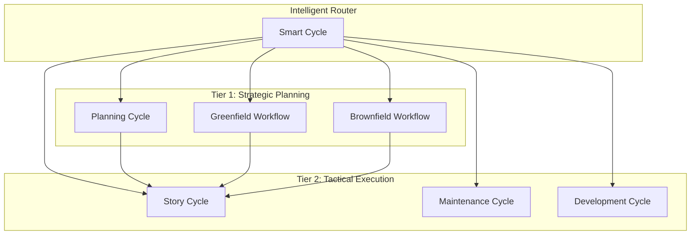
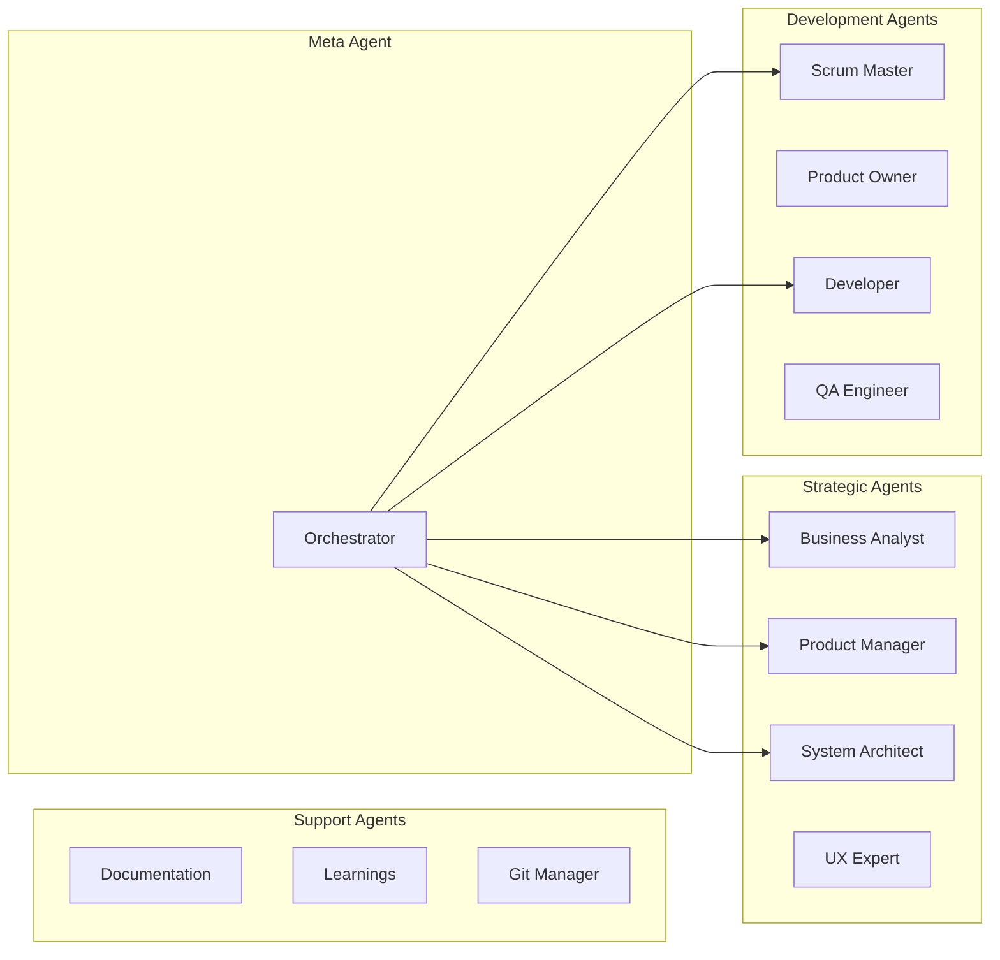
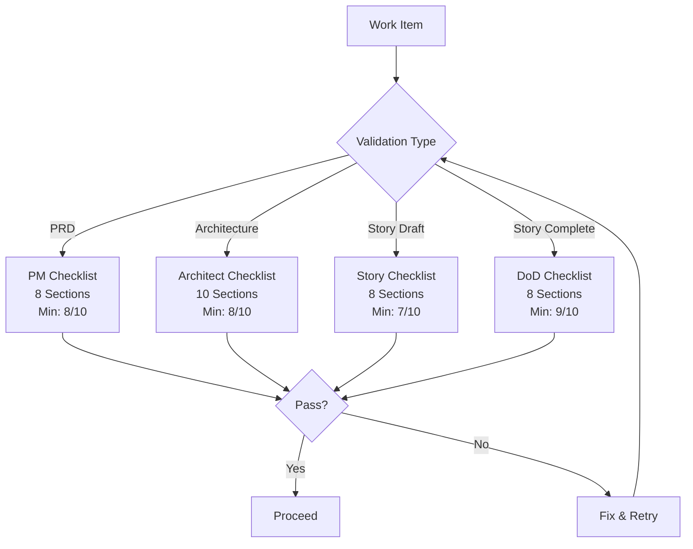
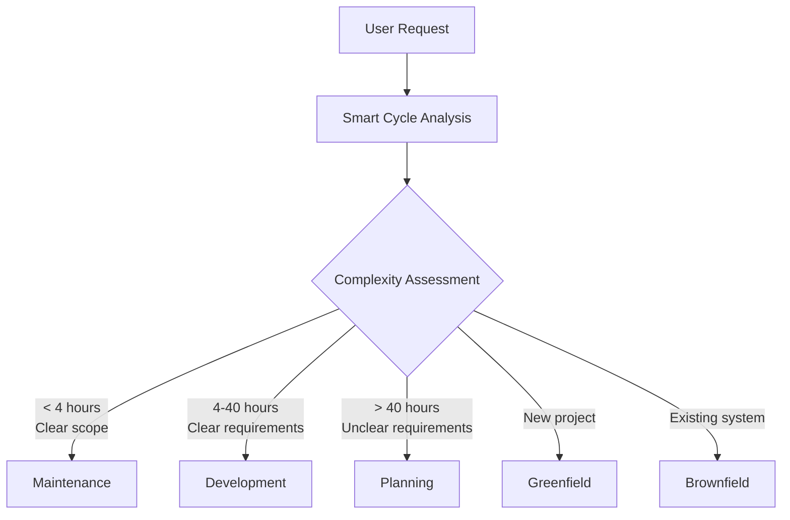

# BMAD-CC System Architecture

## Overview

BMAD-CC (Business Model Accelerated Development for Claude Code) is a comprehensive framework that transforms Claude Code into an enterprise-grade development platform through intelligent workflow orchestration, specialized AI agents, and systematic quality gates.

## Core Architecture Principles

### 1. Strategic-First Development
Every significant development effort begins with strategic analysis before tactical execution. This ensures alignment between business objectives and technical implementation.

### 2. Agent Specialization
Each AI agent represents a specific role with defined expertise, responsibilities, and decision-making authority. Agents don't multitask - they excel at their specialized domain.

### 3. Template-Driven Consistency
Professional-grade templates ensure consistent, complete documentation across all project artifacts. Templates use token replacement for project-specific customization.

### 4. No-Fallback Policy
**CRITICAL**: The system enforces a strict no-dummy-data policy. All implementations must use real data connections. Failures must be visible, not hidden behind fake success.

### 5. Vibe CEO Philosophy
The user is positioned as the "Vibe CEO" - a strategic leader with unlimited resources. The framework empowers strategic thinking while agents handle tactical execution.

## System Components

### Two-Tier Workflow Architecture



### Agent Ecosystem



### Quality Gate System



## Technical Architecture

### Directory Structure

```
project-root/
├── .claude/                    # Claude Code Integration
│   ├── agents/                 # Agent Definitions
│   │   ├── strategic/         # Planning agents
│   │   ├── development/       # Execution agents
│   │   └── support/           # Utility agents
│   ├── commands/bmad/         # Slash Commands
│   │   ├── workflows/         # Main workflows
│   │   └── utilities/         # Helper commands
│   ├── hooks/                 # Automation Hooks
│   │   ├── quality/           # Quality gates
│   │   ├── integration/       # External tools
│   │   └── validation/        # Checklists
│   └── settings.local.json    # Configuration
│
├── docs/                       # Documentation
│   ├── data/                  # Knowledge Base
│   │   ├── elicitation-methods.md
│   │   ├── brainstorming-techniques.md
│   │   └── technical-preferences.md
│   ├── templates/             # Document Templates
│   ├── validation/            # Validation Reports
│   └── lessons/               # Learnings
│
├── .taskmaster/               # Task Management
│   ├── tasks/                 # Task definitions
│   ├── cache/                 # Processing cache
│   └── reports/               # Analytics
│
└── docker/                    # Containerization
    ├── docker-compose.yml     # Service definitions
    ├── frontend/              # Frontend container
    └── backend/               # Backend container
```

### Integration Points

#### Claude Code Integration
- **Slash Commands**: Entry points for workflows (`/bmad:*`)
- **Agents**: Specialized personas loaded via `/agent-name`
- **Hooks**: Bash scripts for automation and quality gates
- **Settings**: Local configuration for permissions

#### External Tool Integration
- **Task Master AI**: Task tracking and management
- **Docker**: Container-based development environment
- **Git/GitHub**: Version control and backup
- **npm/yarn**: Package management

### Token System

Templates use token replacement for customization:

| Token | Description | Example |
|-------|-------------|---------|
| `{{PROJECT_NAME}}` | Project identifier | "MyApp" |
| `{{PROJECT_TYPE}}` | Project category | "saas" |
| `{{PRD_PATH}}` | Requirements location | "docs/prd.md" |
| `{{FRONTEND_DIR}}` | Frontend directory | "frontend" |
| `{{BACKEND_DIR}}` | Backend directory | "backend" |
| `{{FRONTEND_PORT}}` | Frontend port | "3000" |
| `{{BACKEND_PORT}}` | Backend port | "8001" |
| `{{DOCKER_COMPOSE_FILE}}` | Docker config | "docker-compose.yml" |
| `{{TASKMASTER_CLI}}` | Task Master command | "task-master" |

## Workflow Orchestration

### Smart Cycle Classification

The Smart Cycle uses AI-powered classification to route work:



### Classification Criteria

| Factor | Maintenance | Development | Strategic |
|--------|------------|-------------|-----------|
| **Effort** | < 4 hours | 4-40 hours | > 40 hours |
| **Requirements** | Clear | Defined | Needs discovery |
| **Architecture** | No changes | Minor changes | Major changes |
| **Planning** | None | Minimal | Comprehensive |
| **Risk** | Low | Medium | High |

## Quality Assurance Architecture

### Validation Framework

Each validation checklist follows a consistent structure:
1. **Objective Scoring**: 1-10 scale per section
2. **Minimum Thresholds**: Enforced quality gates
3. **Actionable Feedback**: Specific improvement areas
4. **Status Tracking**: APPROVED/CONDITIONAL/REJECTED

### No-Fallback Enforcement

The framework enforces no-dummy-data at multiple levels:

1. **Agent Instructions**: Dev agent prohibits fallback patterns
2. **Code Review**: QA agent searches for violations
3. **Automated Hooks**: `quality-gate-no-dummies.sh` scans code
4. **Architecture Review**: System designs require explicit failure modes

## Scalability & Extensibility

### Expansion Pack Architecture

BMAD-CC supports domain-specific extensions through expansion packs:

```yaml
expansion-pack:
  name: healthcare-pack
  version: 1.0.0
  agents:
    - clinical-specialist
    - compliance-officer
    - hipaa-expert
  workflows:
    - clinical-trial
    - regulatory-approval
  templates:
    - clinical-protocol
    - fda-submission
```

### Document Sharding

Large documents are automatically sharded for efficiency:
- PRDs → Epic-based shards
- Architecture → Component-based shards
- Improves context window usage
- Enables parallel processing

## Security Architecture

### Permission Model
- Agents have defined tool access
- Hooks run with limited permissions
- No credential storage in templates
- Git integration uses SSH keys

### Data Protection
- No hardcoded secrets
- Environment variable usage
- Docker secrets management
- Encrypted communication

## Performance Optimization

### Context Window Management
- Document sharding for large files
- Focused agent specialization
- Clean context between phases
- Efficient token usage

### Parallel Processing
- Multiple agents work concurrently
- Docker containers run in parallel
- Git operations are batched
- Task Master handles async updates

## Monitoring & Observability

### Metrics Collection
- Workflow completion times
- Quality gate pass rates
- Agent utilization metrics
- Error and retry patterns

### Logging Architecture
- Bash hook logging and error reporting
- Docker container logs
- Task Master activity logs
- Git commit history

## Future Architecture Plans

### Planned Enhancements
- Web UI for workflow visualization
- Real-time collaboration features
- Cloud deployment options
- API gateway for external integration

### Expansion Areas
- Machine learning integration
- Advanced analytics dashboard
- Multi-language support
- Enterprise SSO integration

## Design Decisions

### Why Bash for Hooks?
- Universal Unix/Linux compatibility
- Native WSL and macOS support
- Lightweight and fast execution
- Standard shell scripting environment
- Better Docker and Git integration

### Why Markdown for Everything?
- Human-readable documentation
- Version control friendly
- Claude Code native format
- Easy template processing

### Why Task Master Required?
- Centralized task management
- Maintains project context
- Enables workflow continuity
- Provides progress visibility

---

*For implementation details, see [WORKFLOWS-GUIDE.md](WORKFLOWS-GUIDE.md). For customization options, see [CUSTOMIZATION-GUIDE.md](CUSTOMIZATION-GUIDE.md).*