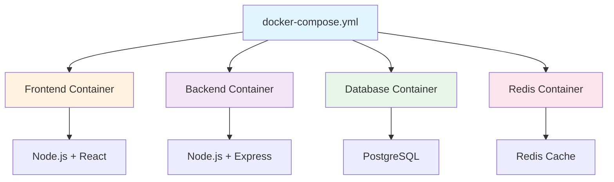

# BMAD-CC Docker Guide

## Overview

BMAD-CC enforces Docker-first development to ensure consistency across all environments. Every line of code is written, tested, and validated inside Docker containers.

## Why Docker-First?

- **Consistency**: Same environment for all developers
- **Isolation**: No conflicts with local dependencies
- **Reproducibility**: "Works on my machine" eliminated
- **Production Parity**: Development mirrors production
- **Easy Onboarding**: New developers productive immediately

---

## Quick Start

### Prerequisites

1. **Install Docker Desktop**:
   - [Windows](https://docs.docker.com/desktop/install/windows-install/)
   - [macOS](https://docs.docker.com/desktop/install/mac-install/)
   - [Linux](https://docs.docker.com/desktop/install/linux-install/)

2. **Verify Installation**:
```bash
docker --version
docker-compose --version
```

3. **Start Docker Desktop**:
   - Windows: Start from Start Menu
   - macOS: `open -a Docker`
   - Linux: `sudo systemctl start docker`

### First Run

```bash
# Start all services
docker-compose up -d

# Verify health
docker-compose ps

# View logs
docker-compose logs -f
```

---

## Docker Architecture

### Service Structure



### Standard Services

| Service | Purpose | Port | Health Check |
|---------|---------|------|--------------|
| `frontend` | UI application | 3000 | `/health` |
| `backend` | API server | 8001 | `/api/health` |
| `db` | PostgreSQL | 5432 | `pg_isready` |
| `redis` | Cache/Queue | 6379 | `redis-cli ping` |

---

## Docker Development Workflow

### All Commands Run in Containers

**CRITICAL**: Never run commands on host machine!

```bash
# ❌ WRONG - Host machine
npm install express

# ✅ CORRECT - Inside container
docker-compose exec backend npm install express
```

### Common Development Commands

#### Package Management
```bash
# Backend packages
docker-compose exec backend npm install [package]
docker-compose exec backend npm update
docker-compose exec backend npm audit fix

# Frontend packages
docker-compose exec frontend npm install [package]
docker-compose exec frontend npm update
```

#### Running Tests
```bash
# Backend tests
docker-compose exec backend npm test
docker-compose exec backend npm run test:unit
docker-compose exec backend npm run test:integration

# Frontend tests
docker-compose exec frontend npm test
docker-compose exec frontend npm run test:e2e
```

#### Database Operations
```bash
# Run migrations
docker-compose exec backend npm run migrate

# Seed database
docker-compose exec backend npm run seed

# Access database
docker-compose exec db psql -U postgres -d myapp
```

#### Debugging
```bash
# Access container shell
docker-compose exec backend /bin/bash
docker-compose exec frontend /bin/sh

# View real-time logs
docker-compose logs -f backend
docker-compose logs -f frontend

# Check specific log entries
docker-compose logs backend | grep ERROR
```

---

## Configuration

### docker-compose.yml Structure

```yaml
version: '3.8'

services:
  frontend:
    build: 
      context: ./frontend
      dockerfile: Dockerfile
    ports:
      - "3000:3000"
    volumes:
      - ./frontend:/app
      - /app/node_modules
    environment:
      - NODE_ENV=development
      - REACT_APP_API_URL=http://localhost:8001
    healthcheck:
      test: ["CMD", "curl", "-f", "http://localhost:3000/health"]
      interval: 30s
      timeout: 10s
      retries: 3
    depends_on:
      - backend

  backend:
    build:
      context: ./backend
      dockerfile: Dockerfile
    ports:
      - "8001:8001"
    volumes:
      - ./backend:/app
      - /app/node_modules
    environment:
      - NODE_ENV=development
      - DATABASE_URL=postgresql://user:pass@db:5432/myapp
      - REDIS_URL=redis://redis:6379
    healthcheck:
      test: ["CMD", "curl", "-f", "http://localhost:8001/api/health"]
      interval: 30s
      timeout: 10s
      retries: 3
    depends_on:
      - db
      - redis

  db:
    image: postgres:14-alpine
    ports:
      - "5432:5432"
    environment:
      - POSTGRES_USER=user
      - POSTGRES_PASSWORD=pass
      - POSTGRES_DB=myapp
    volumes:
      - postgres_data:/var/lib/postgresql/data
    healthcheck:
      test: ["CMD-SHELL", "pg_isready -U user"]
      interval: 10s
      timeout: 5s
      retries: 5

  redis:
    image: redis:7-alpine
    ports:
      - "6379:6379"
    healthcheck:
      test: ["CMD", "redis-cli", "ping"]
      interval: 10s
      timeout: 5s
      retries: 5

volumes:
  postgres_data:

networks:
  default:
    name: bmad-network
```

### Dockerfile Best Practices

**Frontend Dockerfile**:
```dockerfile
FROM node:18-alpine

WORKDIR /app

# Copy package files
COPY package*.json ./

# Install dependencies
RUN npm ci --only=production

# Copy application
COPY . .

# Build application
RUN npm run build

# Expose port
EXPOSE 3000

# Start application
CMD ["npm", "start"]
```

**Backend Dockerfile**:
```dockerfile
FROM node:18-alpine

WORKDIR /app

# Install build dependencies
RUN apk add --no-cache python3 make g++

# Copy package files
COPY package*.json ./

# Install dependencies
RUN npm ci

# Copy application
COPY . .

# Expose port
EXPOSE 8001

# Start with nodemon for development
CMD ["npm", "run", "dev"]
```

---

## Docker Manager Hook

### Automatic Container Management

The `docker-manager.ps1` hook provides:

```powershell
# Start containers
./.claude/hooks/docker-manager.ps1 start

# Check health
./.claude/hooks/docker-manager.ps1 health

# Stop containers
./.claude/hooks/docker-manager.ps1 stop

# Restart services
./.claude/hooks/docker-manager.ps1 restart

# View status
./.claude/hooks/docker-manager.ps1 status
```

### Health Monitoring

Automatic health checks before operations:
```powershell
# In workflows
./.claude/hooks/docker-manager.ps1 health
if ($LASTEXITCODE -ne 0) {
    Write-Error "Services unhealthy"
    exit 1
}
```

---

## Environment Management

### Development Environment

```yaml
# docker-compose.override.yml
services:
  backend:
    environment:
      - DEBUG=true
      - LOG_LEVEL=debug
    volumes:
      - ./backend:/app  # Hot reload
```

### Production Environment

```yaml
# docker-compose.prod.yml
services:
  backend:
    environment:
      - DEBUG=false
      - LOG_LEVEL=info
    restart: always
```

### Environment Variables

```bash
# .env file
NODE_ENV=development
DATABASE_URL=postgresql://user:pass@db:5432/myapp
REDIS_URL=redis://redis:6379
JWT_SECRET=your-secret-key
```

---

## Volume Management

### Types of Volumes

| Type | Purpose | Example |
|------|---------|---------|
| **Bind Mounts** | Development code | `./src:/app/src` |
| **Named Volumes** | Persistent data | `postgres_data:/var/lib/postgresql/data` |
| **Anonymous Volumes** | Dependencies | `/app/node_modules` |

### Volume Best Practices

```yaml
volumes:
  # Source code - bind mount for hot reload
  - ./frontend/src:/app/src
  
  # Dependencies - anonymous volume
  - /app/node_modules
  
  # Database - named volume
  - postgres_data:/var/lib/postgresql/data
  
  # Uploads - named volume
  - uploads:/app/uploads
```

---

## Networking

### Service Communication

Services communicate using service names:

```javascript
// Backend connecting to database
const db = new Pool({
  host: 'db',  // Service name, not localhost
  port: 5432,
  database: 'myapp'
});

// Frontend calling backend
const API_URL = 'http://backend:8001';  // In container
const API_URL = 'http://localhost:8001'; // From host
```

### Custom Networks

```yaml
networks:
  frontend:
    driver: bridge
  backend:
    driver: bridge
    
services:
  frontend:
    networks:
      - frontend
      
  backend:
    networks:
      - frontend
      - backend
```

---

## Performance Optimization

### Build Optimization

```dockerfile
# Multi-stage build
FROM node:18-alpine AS builder
WORKDIR /app
COPY package*.json ./
RUN npm ci
COPY . .
RUN npm run build

FROM node:18-alpine
WORKDIR /app
COPY --from=builder /app/dist ./dist
COPY package*.json ./
RUN npm ci --only=production
CMD ["node", "dist/index.js"]
```

### Caching Strategies

```yaml
services:
  backend:
    build:
      context: .
      cache_from:
        - myapp/backend:latest
```

### Resource Limits

```yaml
services:
  backend:
    deploy:
      resources:
        limits:
          cpus: '0.5'
          memory: 512M
        reservations:
          cpus: '0.25'
          memory: 256M
```

---

## Troubleshooting

### Common Issues

| Problem | Solution |
|---------|----------|
| Container won't start | Check logs: `docker-compose logs service-name` |
| Port already in use | Change port or stop conflicting service |
| Permission denied | Fix ownership: `docker-compose exec backend chown -R node:node /app` |
| Out of space | Clean up: `docker system prune -a` |
| Slow performance | Allocate more resources in Docker Desktop settings |

### Debugging Commands

```bash
# Inspect container
docker inspect container-name

# View processes
docker-compose top

# Check resource usage
docker stats

# Network debugging
docker network ls
docker network inspect bmad-network

# Volume inspection
docker volume ls
docker volume inspect volume-name
```

### Reset Everything

```bash
# Stop all containers
docker-compose down

# Remove all containers, networks, volumes
docker-compose down -v

# Clean entire Docker system
docker system prune -a --volumes

# Rebuild from scratch
docker-compose build --no-cache
docker-compose up -d
```

---

## CI/CD Integration

### GitHub Actions

```yaml
name: Docker CI

on: [push, pull_request]

jobs:
  test:
    runs-on: ubuntu-latest
    steps:
      - uses: actions/checkout@v2
      
      - name: Build containers
        run: docker-compose build
        
      - name: Run tests
        run: |
          docker-compose up -d
          docker-compose exec -T backend npm test
          docker-compose exec -T frontend npm test
          
      - name: Cleanup
        run: docker-compose down -v
```

### Production Deployment

```bash
# Build production images
docker-compose -f docker-compose.prod.yml build

# Push to registry
docker-compose -f docker-compose.prod.yml push

# Deploy
docker-compose -f docker-compose.prod.yml up -d
```

---

## Best Practices

### Development Workflow

1. **Always use containers** - Never install dependencies locally
2. **One service per container** - Follow microservice principles
3. **Use health checks** - Ensure services are ready
4. **Persist data properly** - Use named volumes for databases
5. **Keep images small** - Use alpine variants, multi-stage builds

### Security

1. **Don't run as root** - Use USER directive
2. **Scan images** - `docker scan image-name`
3. **Use secrets** - Never hardcode credentials
4. **Update regularly** - Keep base images current
5. **Limit resources** - Prevent runaway containers

### Team Collaboration

1. **Commit docker-compose.yml** - Share configuration
2. **Use .env.example** - Document required variables
3. **Document ports** - Avoid conflicts
4. **Share volumes carefully** - Understand mount behavior
5. **Version lock images** - Ensure consistency

---

## Integration with BMAD Workflows

### Automatic Container Management

All BMAD workflows automatically:
1. Check Docker availability
2. Start required services
3. Verify health checks
4. Execute commands in containers
5. Handle cleanup

### Agent Docker Usage

| Agent | Docker Integration |
|-------|-------------------|
| Developer | All code runs in containers |
| QA | Tests execute in containers |
| Database | Migrations in db container |
| Git | Commits include container changes |

---

*For more help, see [TROUBLESHOOTING.md](TROUBLESHOOTING.md) or [DOCUMENTATION-MAP.md](DOCUMENTATION-MAP.md).*