# BMAD-CC Quality Gates Guide

## Overview

BMAD-CC implements comprehensive quality gates that prevent 60-80% of common development issues through systematic validation at every phase. Quality is not optional - it's enforced through automated checks and validation checklists.

## Core Quality Principles

### 1. No-Fallback Policy
**CRITICAL**: No dummy data, mock implementations, or silent failures in production code.

### 2. Validation-Driven Development
Every major artifact requires validation before proceeding to the next phase.

### 3. Incremental Quality
Quality is built incrementally through multiple checkpoints, not bolted on at the end.

### 4. Automated Enforcement
Hooks and scripts automatically enforce quality standards.

---

## Quality Gate Architecture

```mermaid
flowchart TD
    A[Work Item] --> B{Type?}
    
    B -->|PRD| C[PRD Validation<br/>8 sections, Min 8/10]
    B -->|Architecture| D[Architecture Validation<br/>10 sections, Min 8/10]
    B -->|Story Draft| E[Story Draft Validation<br/>8 sections, Min 7/10]
    B -->|Story Complete| F[Story DoD Validation<br/>8 sections, Min 9/10]
    B -->|Project Setup| G[Project Validation<br/>6 sections, Min 7/10]
    
    C --> H{Pass?}
    D --> H
    E --> H
    F --> H
    G --> H
    
    H -->|Yes| I[✅ Proceed]
    H -->|No| J[🔄 Fix & Retry]
    
    style I fill:#c8e6c9
    style J fill:#ffcdd2
```



---

## Validation Checklists

### PRD Validation Checklist

**File**: `docs/templates/pm-checklist.md`  
**Agent**: Product Manager  
**Command**: `validate-prd`  
**Minimum Score**: 8/10

#### Sections Validated:
1. **Product Vision & Strategy** (Score: 1-10)
   - Clear vision statement
   - Strategic objectives defined
   - Success metrics identified
   - Market positioning clear

2. **Requirements Completeness** (Score: 1-10)
   - All features documented
   - User stories defined
   - Acceptance criteria clear
   - Dependencies identified

3. **User Personas & Use Cases** (Score: 1-10)
   - Target users defined
   - Use cases documented
   - User journeys mapped
   - Pain points addressed

4. **Technical Feasibility** (Score: 1-10)
   - Technical constraints considered
   - Integration points identified
   - Performance requirements defined
   - Security requirements specified

5. **Business Case** (Score: 1-10)
   - ROI projections
   - Cost estimates
   - Timeline realistic
   - Resource requirements

6. **Risk Assessment** (Score: 1-10)
   - Risks identified
   - Mitigation strategies
   - Dependencies mapped
   - Contingency plans

7. **Success Metrics** (Score: 1-10)
   - KPIs defined
   - Measurement plan
   - Baseline established
   - Targets set

8. **Stakeholder Alignment** (Score: 1-10)
   - Stakeholders identified
   - Approval process defined
   - Communication plan
   - Feedback incorporated

---

### Architecture Validation Checklist

**File**: `docs/templates/architect-checklist.md`  
**Agent**: System Architect  
**Command**: `validate-architecture`  
**Minimum Score**: 8/10

#### Sections Validated:
1. **Requirements Alignment** (Score: 1-10)
2. **Standards Compliance** (Score: 1-10)
3. **Scalability & Performance** (Score: 1-10)
4. **Security & Privacy** (Score: 1-10)
5. **Integration & APIs** (Score: 1-10)
6. **Data Architecture** (Score: 1-10)
7. **Technology Stack** (Score: 1-10)
8. **Deployment & Operations** (Score: 1-10)
9. **Cost & Resources** (Score: 1-10)
10. **Risk & Mitigation** (Score: 1-10)

#### No-Fallback Architecture Requirements:
- Explicit failure modes designed
- Observable system states
- No silent degradation
- Error propagation paths clear
- Monitoring and alerting defined

---

### Story Draft Validation Checklist

**File**: `docs/templates/story-draft-checklist.md`  
**Agent**: Scrum Master  
**Command**: `validate-story-draft`  
**Minimum Score**: 7/10

#### Sections Validated:
1. **Story Clarity** (Score: 1-10)
   - Clear title and description
   - User story format correct
   - Business value articulated
   - Scope well-defined

2. **Acceptance Criteria** (Score: 1-10)
   - Measurable criteria
   - Testable conditions
   - Edge cases covered
   - Performance criteria

3. **Technical Readiness** (Score: 1-10)
   - Technical approach defined
   - Dependencies identified
   - API contracts specified
   - Database changes planned

4. **Task Breakdown** (Score: 1-10)
   - Tasks clearly defined
   - Estimates provided
   - Sequence logical
   - Parallelization identified

5. **Testing Strategy** (Score: 1-10)
   - Test cases defined
   - Test data requirements
   - Integration tests planned
   - Performance tests specified

6. **Dependencies** (Score: 1-10)
   - External dependencies
   - Team dependencies
   - Technical prerequisites
   - Blocking issues

7. **Definition of Ready** (Score: 1-10)
   - All information available
   - Team understands story
   - Impediments removed
   - Resources available

8. **Risk Assessment** (Score: 1-10)
   - Technical risks
   - Timeline risks
   - Quality risks
   - Mitigation plans

---

### Story Completion (DoD) Checklist

**File**: `docs/templates/story-dod-checklist.md`  
**Agent**: QA Engineer  
**Command**: `validate-story-completion`  
**Minimum Score**: 9/10

#### Sections Validated:
1. **Code Implementation** (Score: 1-10)
   - All acceptance criteria met
   - Code follows standards
   - No hardcoded values
   - Error handling complete
   - **No dummy data or fallbacks**

2. **Testing Coverage** (Score: 1-10)
   - Unit tests > 80%
   - Integration tests pass
   - E2E tests complete
   - Performance validated
   - Security tested

3. **Documentation** (Score: 1-10)
   - Code documented
   - API docs updated
   - User guide updated
   - CHANGELOG updated
   - README current

4. **Code Review** (Score: 1-10)
   - Peer review complete
   - Feedback addressed
   - No critical issues
   - Best practices followed
   - No fallback patterns

5. **Performance** (Score: 1-10)
   - Performance targets met
   - Load testing complete
   - Resource usage optimal
   - Database queries optimized
   - Caching implemented

6. **Security** (Score: 1-10)
   - Security review done
   - Vulnerabilities addressed
   - Authentication proper
   - Authorization correct
   - Data protection ensured

7. **Integration** (Score: 1-10)
   - Integration tests pass
   - API contracts validated
   - Database migrations work
   - External services integrated
   - Backward compatible

8. **Deployment Ready** (Score: 1-10)
   - Build successful
   - Deployment tested
   - Rollback plan exists
   - Monitoring configured
   - Alerts set up

---

### Project Setup Validation

**File**: `docs/templates/po-master-checklist.md`  
**Agent**: Product Owner  
**Command**: `validate-project-setup`  
**Minimum Score**: 7/10

#### Sections Validated:
1. **Foundation** (Score: 1-10)
   - Git repository
   - Docker setup
   - Task Master initialized
   - CI/CD configured

2. **Documentation** (Score: 1-10)
   - README complete
   - CLAUDE.md configured
   - Technical preferences set
   - Architecture documented

3. **Standards** (Score: 1-10)
   - Coding standards defined
   - Testing strategy clear
   - Git workflow established
   - Review process defined

4. **Team Alignment** (Score: 1-10)
   - Roles defined
   - Responsibilities clear
   - Communication channels
   - Meeting cadence

5. **Technical Setup** (Score: 1-10)
   - Development environment
   - Dependencies installed
   - Build system working
   - Tests running

6. **Planning** (Score: 1-10)
   - Roadmap defined
   - First sprint planned
   - Backlog created
   - Priorities set

---

## Automated Quality Enforcement

### Hook System

#### quality-gate-no-dummies.ps1
Scans for dummy data and fallback patterns:
```powershell
# Detects patterns like:
- catch blocks returning fake success
- hardcoded test data
- placeholder values
- silent failure handlers
```

#### gate-enforcer.ps1
Enforces phase transitions:
```powershell
# Validates:
- Required approvals
- Minimum scores met
- Dependencies resolved
- Previous phase complete
```

#### validation-enforcer.ps1
Runs validation checklists:
```powershell
# Executes:
- Appropriate checklist for artifact
- Calculates scores
- Generates reports
- Blocks on failure
```

### Docker Health Checks

All services monitored:
```yaml
healthcheck:
  test: ["CMD", "curl", "-f", "http://localhost:8001/health"]
  interval: 30s
  timeout: 10s
  retries: 3
```

### Task Master Integration

Quality gates linked to tasks:
```bash
# Quality gate before marking done
if [[ $(validate-story-completion) -lt 9 ]]; then
  task-master set-status --id=$TASK_ID --status=blocked
  echo "Quality gate failed"
  exit 1
fi
```

---

## Testing Strategies

### Test Pyramid


### Coverage Requirements

| Test Type | Minimum Coverage | Tools |
|-----------|-----------------|-------|
| Unit Tests | 80% | Jest, Pytest, Go test |
| Integration | Critical paths | Postman, Supertest |
| E2E | User journeys | Cypress, Playwright |
| Performance | API endpoints | K6, JMeter |
| Security | OWASP Top 10 | ZAP, Snyk |

### Testing in Docker

All tests run in containers:
```bash
# Backend tests
docker-compose exec backend npm test
docker-compose exec backend pytest

# Frontend tests
docker-compose exec frontend npm test
docker-compose exec frontend npm run e2e

# Integration tests
docker-compose exec test npm run integration
```

---

## No-Fallback Policy Enforcement

### Prohibited Patterns

```javascript
// ❌ NEVER DO THIS
try {
  const data = await fetchData();
  return data;
} catch (error) {
  return { dummy: 'data' }; // PROHIBITED
}

// ✅ DO THIS INSTEAD
try {
  const data = await fetchData();
  if (!data) throw new Error('No data received');
  return data;
} catch (error) {
  logger.error('Fetch failed:', error);
  throw error; // Let it fail visibly
}
```

### Detection Methods

1. **Agent Instructions** - Dev agent trained to avoid
2. **Code Review** - QA agent actively searches
3. **Automated Scanning** - Hook detects patterns
4. **Validation Checklists** - Explicit checks

### Enforcement Levels

| Level | Method | Action |
|-------|--------|--------|
| Prevention | Agent training | Avoid creating |
| Detection | Automated scan | Flag violations |
| Review | QA validation | Reject code |
| Runtime | Monitoring | Alert on issues |

---

## Quality Metrics

### Key Performance Indicators

| Metric | Target | Measurement |
|--------|--------|-------------|
| Defect Escape Rate | < 5% | Bugs found in production |
| Test Coverage | > 80% | Code coverage tools |
| Code Review Coverage | 100% | PR review rate |
| Build Success Rate | > 95% | CI/CD metrics |
| Mean Time to Repair | < 4 hours | Issue tracking |
| Quality Gate Pass Rate | > 90% | Validation reports |

### Quality Dashboard


---

## Continuous Improvement

### Quality Retrospectives

After each cycle:
1. Review quality metrics
2. Identify quality issues
3. Update checklists
4. Improve processes
5. Share learnings

### Checklist Evolution

Checklists updated based on:
- Common failure patterns
- New requirements
- Technology changes
- Team feedback
- Industry best practices

### Learning Integration

Lessons feed back into:
- Updated checklists
- Enhanced validation
- Agent training
- Process improvements
- Documentation updates

---

## Troubleshooting Quality Issues

### Common Quality Problems

| Issue | Cause | Solution |
|-------|-------|----------|
| Low test coverage | Rushed development | Enforce TDD |
| Validation failures | Incomplete work | Use checklists earlier |
| Dummy data found | Old habits | Training + automation |
| Performance issues | No testing | Add performance gates |
| Security vulnerabilities | Lack of review | Security checklist |

### Quality Recovery Process

When quality gates fail:
1. Stop progression immediately
2. Identify root cause
3. Fix issues completely
4. Re-run validation
5. Document lessons learned
6. Update processes

---

## Best Practices

### Quality-First Development
1. Write tests before code
2. Review checklists before starting
3. Validate incrementally
4. Fix issues immediately
5. Document everything

### Team Quality Culture
- Everyone owns quality
- Quality is not negotiable
- Learn from failures
- Celebrate quality wins
- Continuous improvement

### Tools & Automation
- Automate repetitive checks
- Use quality dashboards
- Monitor continuously
- Alert on degradation
- Track trends

---

*For workflow integration, see [WORKFLOWS-GUIDE.md](WORKFLOWS-GUIDE.md). For troubleshooting, see [TROUBLESHOOTING.md](TROUBLESHOOTING.md).*