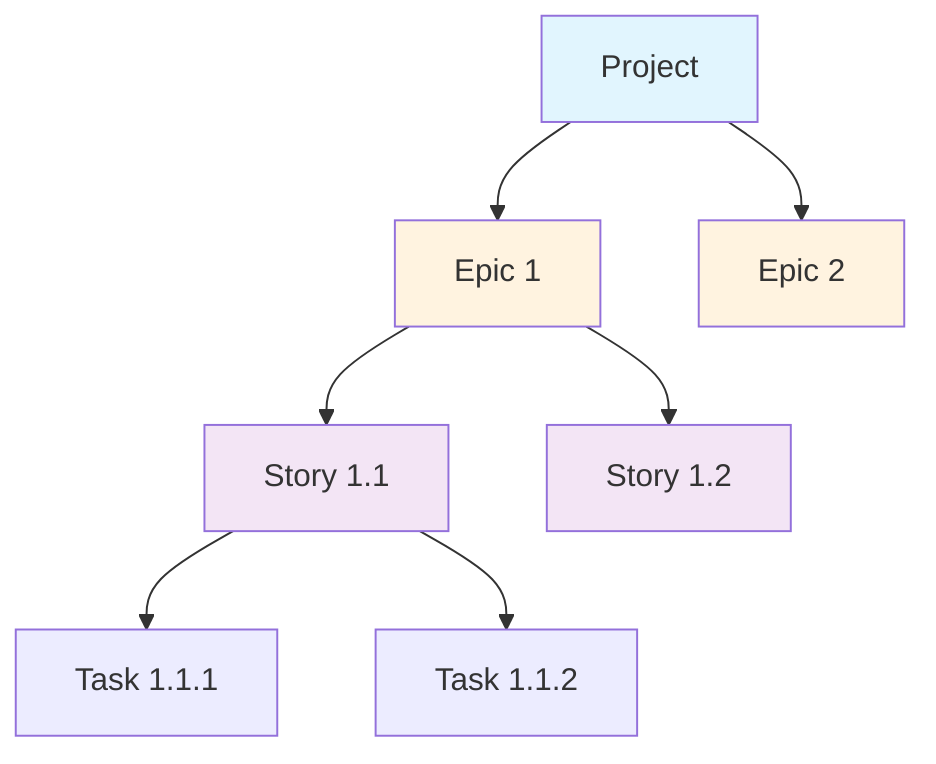
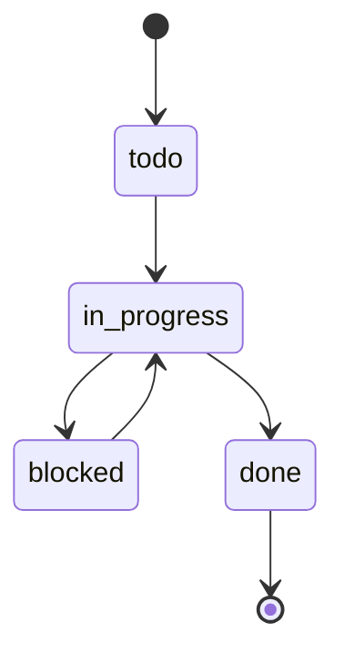
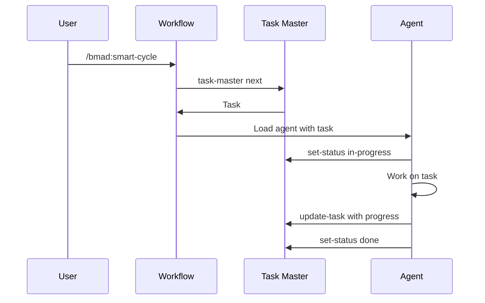

# BMAD-CC Task Master Guide

## Overview

Task Master AI is the central nervous system of BMAD-CC, providing task management, progress tracking, and workflow coordination. It's a **required** component that maintains context across all development activities.

## Why Task Master is Required

- **Context Preservation**: Maintains project state across sessions
- **Progress Visibility**: Track what's done, in progress, and blocked
- **Workflow Continuity**: Links all work to specific tasks
- **Team Coordination**: Multiple agents work on same task system
- **Metrics & Velocity**: Measure and improve productivity

---

## Installation & Setup

### Initial Installation

```bash
# Install globally (recommended)
npm install -g task-master-ai

# Verify installation
task-master --version

# Initialize in project
task-master init -y

# Configure AI models
task-master models --set-main opus
task-master models --set-fallback sonnet
```

### Automatic Setup via BMAD

When you run any BMAD workflow, Task Master is automatically initialized:

```bash
/bmad:smart-cycle
# Automatically checks and initializes Task Master if needed
```

---

## Task Master Architecture

### Task Hierarchy



### Task States



| State | Description | Next Actions |
|-------|-------------|--------------|
| `todo` | Not started | Can start work |
| `in_progress` | Active work | Update or complete |
| `blocked` | Waiting on dependency | Resolve blocker |
| `done` | Completed | Archive or reference |
| `cancelled` | No longer needed | Remove from active list |

---

## Core Commands

### Task Creation

```bash
# Create a single task
task-master create --title="Implement user authentication" --description="Add JWT-based auth"

# Create with type
task-master create --title="User Auth Epic" --type=epic

# Create subtask
task-master create --parent=23 --title="Create login form"
```

### Task Management

```bash
# View next available task
task-master next

# Get specific task details
task-master show 123

# List all tasks
task-master list

# List with subtasks
task-master list --with-subtasks

# Update task status
task-master set-status --id=123 --status=in-progress

# Add notes to task
task-master update-task --id=123 --prompt="Added unit tests, 85% coverage"
```

### Task Expansion

```bash
# Break complex task into subtasks
task-master expand --id=123 --num=5

# Example output:
# Created 5 subtasks:
# 124: Design database schema
# 125: Create API endpoints
# 126: Implement frontend
# 127: Write tests
# 128: Update documentation
```

---

## PRD Integration

### Parsing PRDs into Tasks

Task Master can automatically parse Product Requirements Documents:

```bash
# Parse a PRD file
task-master parse-prd --input=docs/prd.md --force

# Parse with custom epic detection
task-master parse-prd --input=requirements.md --epic-pattern="Feature:"
```

### PRD Structure for Best Parsing

```markdown
# Product Requirements Document

## Epic 1: User Management
### Story 1.1: User Registration
- Task: Create registration form
- Task: Implement email verification
- Task: Add password strength validation

### Story 1.2: User Login
- Task: Create login page
- Task: Implement JWT tokens
- Task: Add remember me feature

## Epic 2: Dashboard
### Story 2.1: Analytics Display
- Task: Design dashboard layout
- Task: Integrate charts library
- Task: Create data APIs
```

---

## Workflow Integration

### BMAD Workflow Usage

Every BMAD workflow integrates Task Master:



### Agent Integration

Each agent interacts with Task Master:

| Agent | Task Master Usage |
|-------|-------------------|
| Orchestrator | Routes based on task type |
| Scrum Master | Creates stories from epics |
| Developer | Updates task during coding |
| QA | Validates task completion |
| Git | Links commits to tasks |

---

## Advanced Features

### Task Dependencies

```bash
# Create dependent task
task-master create --title="Deploy to production" --depends-on=123,124,125

# View dependency graph
task-master deps --id=126

# Check if dependencies met
task-master can-start --id=126
```

### Task Templates

```bash
# Save task as template
task-master template save --id=123 --name="standard-feature"

# Create from template
task-master template use --name="standard-feature" --title="New feature"
```

### Bulk Operations

```bash
# Update multiple tasks
task-master bulk set-status --ids=123,124,125 --status=done

# Assign tasks to sprint
task-master bulk set-sprint --ids=130-140 --sprint=5

# Add label to tasks
task-master bulk add-label --ids=150-160 --label="high-priority"
```

---

## Git Integration

### Commit Linking

```bash
# Include task ID in commit message
git commit -m "feat: implement user auth [task: 123]"

# Task Master automatically updates task with commit SHA
```

### Branch Management

```bash
# Create branch from task
task-master git create-branch --id=123
# Creates: feature/123-implement-user-auth

# Link existing branch
task-master git link-branch --id=123 --branch=feature/auth
```

### PR Integration

```bash
# Create PR with task context
task-master git create-pr --id=123

# Generates PR with:
# - Title from task
# - Description from task details
# - Links to related tasks
# - Checklist from subtasks
```

---

## Reporting & Analytics

### Progress Reports

```bash
# Sprint progress
task-master report sprint --current

# Epic status
task-master report epic --id=10

# Velocity metrics
task-master report velocity --weeks=4

# Burndown chart
task-master report burndown --sprint=5
```

### Task Metrics

```bash
# Time tracking
task-master time --id=123 --add=2h30m

# View time spent
task-master time --id=123

# Estimate vs actual
task-master report estimates --sprint=5
```

### Export Options

```bash
# Export to JSON
task-master export --format=json --output=tasks.json

# Export to CSV
task-master export --format=csv --output=tasks.csv

# Generate markdown report
task-master export --format=md --output=sprint-report.md
```

---

## Configuration

### Project Configuration

`.taskmaster/config.json`:
```json
{
  "project": {
    "name": "My App",
    "type": "saas",
    "methodology": "scrum"
  },
  "models": {
    "main": "opus",
    "fallback": "sonnet"
  },
  "defaults": {
    "epic_size": 8,
    "story_size": 5,
    "task_size": 3
  },
  "integration": {
    "git": true,
    "github": true,
    "slack": false
  }
}
```

### User Preferences

`~/.taskmaster/preferences.json`:
```json
{
  "display": {
    "format": "table",
    "colors": true,
    "verbose": false
  },
  "notifications": {
    "desktop": true,
    "sound": false
  },
  "shortcuts": {
    "n": "next",
    "s": "show",
    "l": "list"
  }
}
```

---

## Troubleshooting

### Common Issues

| Issue | Solution |
|-------|----------|
| No tasks available | Parse PRD or create initial task |
| Task stuck in progress | Check for blockers, update status |
| Can't find task | Use `task-master search "keyword"` |
| Duplicate tasks | Use `task-master dedupe` |
| Corrupted data | Run `task-master repair` |

### Debug Commands

```bash
# Verbose output
task-master --verbose next

# Debug mode
export TASK_MASTER_DEBUG=1
task-master show 123

# Validate data
task-master validate

# Rebuild index
task-master rebuild-index

# Clear cache
task-master clear-cache
```

### Recovery Procedures

```bash
# Backup current state
task-master backup --output=backup.json

# Restore from backup
task-master restore --input=backup.json

# Reset to clean state
task-master reset --confirm

# Reimport from PRD
task-master parse-prd --input=docs/prd.md --force --clean
```

---

## Best Practices

### Task Creation

1. **Use descriptive titles** - "Implement user authentication" not "Auth"
2. **Add acceptance criteria** - Clear definition of done
3. **Estimate effort** - Helps with planning
4. **Link related tasks** - Maintain context
5. **Update regularly** - Keep status current

### Task Organization

1. **One epic per major feature** - Logical grouping
2. **5-8 stories per epic** - Manageable chunks
3. **3-5 tasks per story** - Atomic work units
4. **Use labels** - Categorize and filter
5. **Set priorities** - Focus on important work

### Team Collaboration

1. **Update before switching** - Leave notes for next person
2. **Document blockers** - Help others help you
3. **Link commits** - Maintain traceability
4. **Regular sync** - `task-master pull` for team updates
5. **Clean up done tasks** - Archive completed work

---

## Integration with CI/CD

### GitHub Actions

```yaml
name: Task Master CI

on:
  pull_request:
    types: [opened, synchronize]

jobs:
  update-tasks:
    runs-on: ubuntu-latest
    steps:
      - uses: actions/checkout@v2
      
      - name: Install Task Master
        run: npm install -g task-master-ai
        
      - name: Extract task from PR
        run: |
          TASK_ID=$(echo "${{ github.event.pull_request.title }}" | grep -oP '\[task: \K\d+')
          task-master update-task --id=$TASK_ID --prompt="PR opened: #${{ github.event.pull_request.number }}"
          
      - name: Update status
        run: task-master set-status --id=$TASK_ID --status=in-review
```

### Webhooks

```javascript
// Webhook handler for task updates
app.post('/webhook/task-master', (req, res) => {
  const { task, event } = req.body;
  
  if (event === 'task.completed') {
    // Trigger deployment
    deployToStaging(task.id);
  }
  
  res.json({ received: true });
});
```

---

## Advanced Workflows

### Custom Task Types

```bash
# Define custom type
task-master type create --name="bug" --color="red" --icon="🐛"

# Create bug task
task-master create --type=bug --title="Fix login error" --severity=high
```

### Automation Rules

```bash
# Auto-assign tasks
task-master rule create --name="auto-assign" \
  --condition="label:frontend" \
  --action="assign:@frontend-team"

# Auto-transition states
task-master rule create --name="auto-done" \
  --condition="subtasks:all-done" \
  --action="set-status:done"
```

### Integration Scripts

```bash
#!/bin/bash
# Daily standup report

echo "📅 Daily Standup - $(date)"
echo "========================"

echo "\n✅ Completed Yesterday:"
task-master list --status=done --since=yesterday

echo "\n🚀 In Progress Today:"
task-master list --status=in-progress

echo "\n🚧 Blocked:"
task-master list --status=blocked

echo "\n📋 Up Next:"
task-master next --limit=5
```

---

## Tips & Tricks

### Keyboard Shortcuts

| Shortcut | Command | Description |
|----------|---------|-------------|
| `tm n` | `next` | Get next task |
| `tm s 123` | `show 123` | Show task details |
| `tm l` | `list` | List all tasks |
| `tm u 123` | `update 123` | Update task |
| `tm d 123` | `done 123` | Mark as done |

### Aliases

```bash
# Add to ~/.bashrc or ~/.zshrc
alias tmn="task-master next"
alias tms="task-master show"
alias tml="task-master list"
alias tmu="task-master update-task"
alias tmd="task-master set-status --status=done"
```

### Quick Filters

```bash
# Today's tasks
task-master list --due=today

# High priority
task-master list --priority=high

# My tasks
task-master list --assigned=me

# Overdue
task-master list --overdue

# Recently updated
task-master list --updated="last 2 hours"
```

---

*For workflow integration, see [WORKFLOWS-GUIDE.md](WORKFLOWS-GUIDE.md). For troubleshooting, see [TROUBLESHOOTING.md](TROUBLESHOOTING.md).*