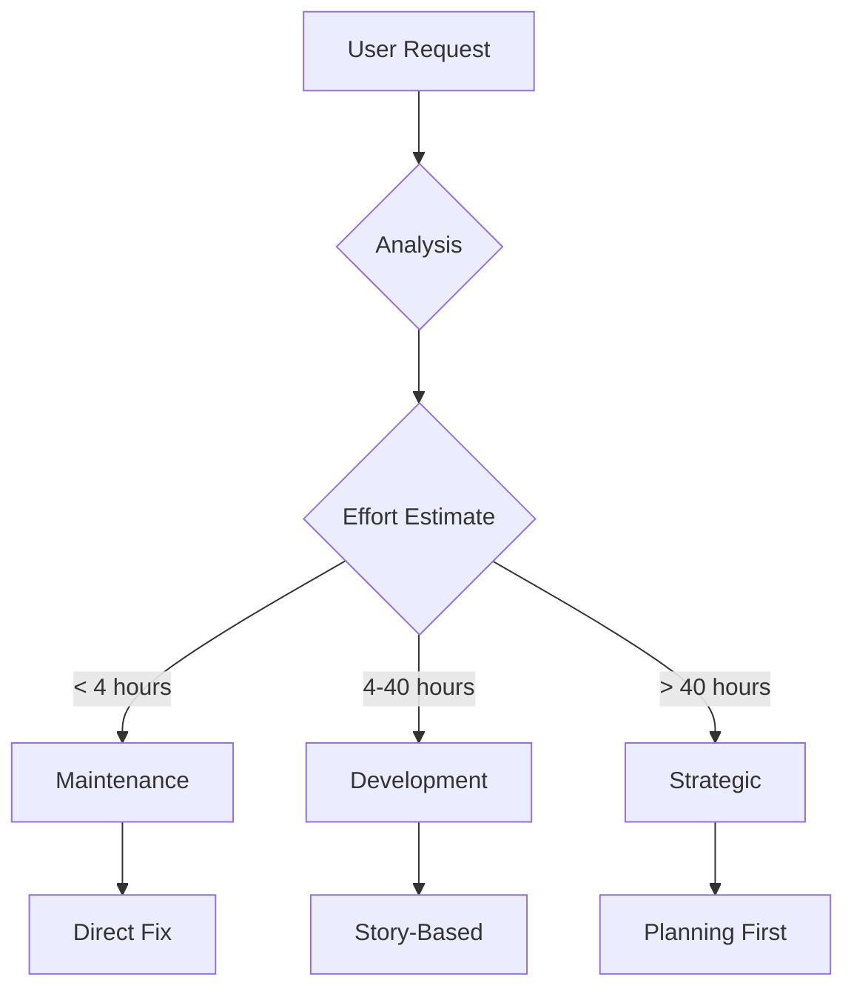
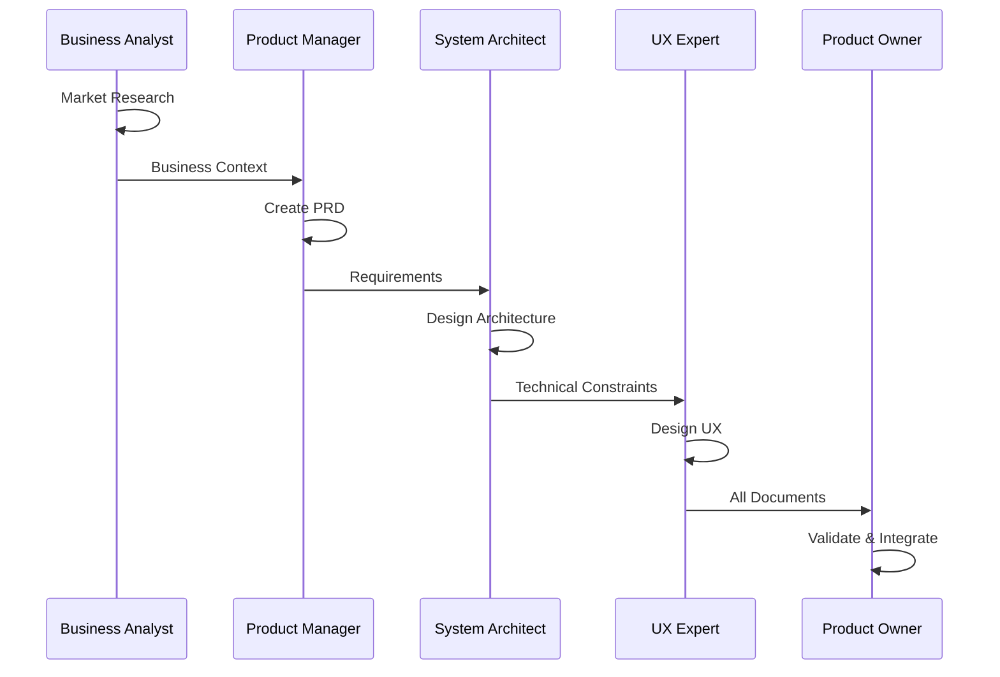
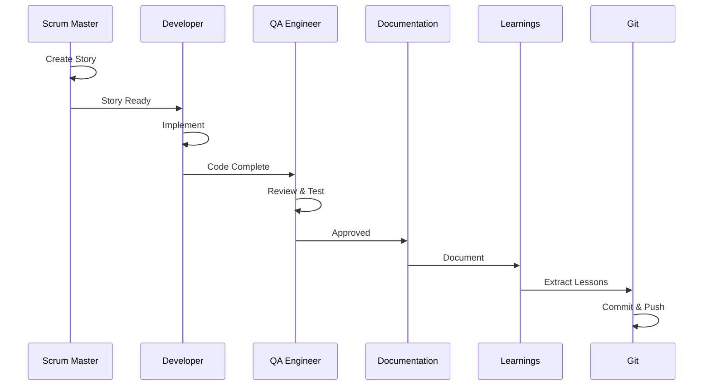
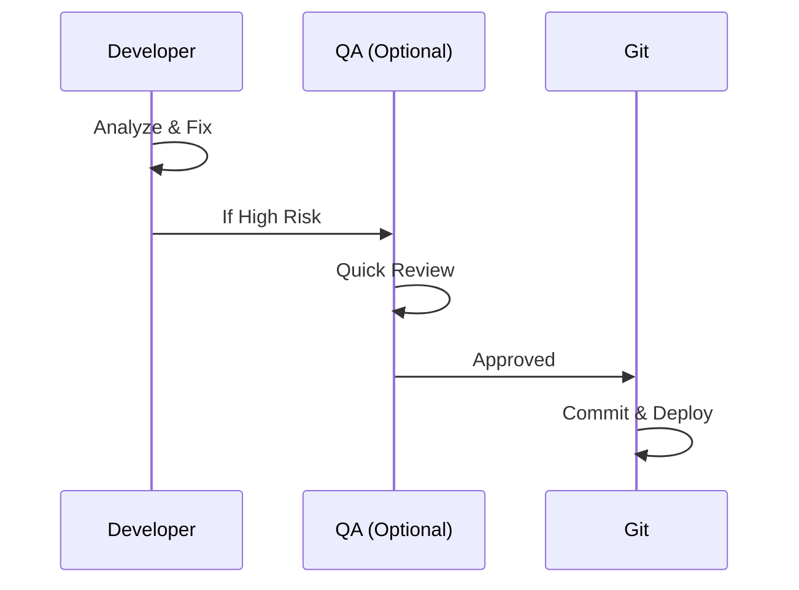
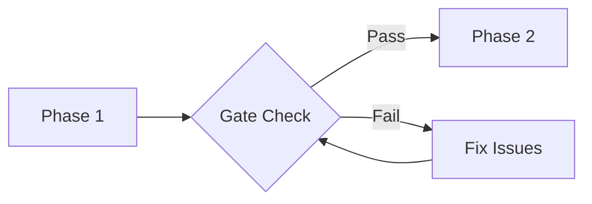
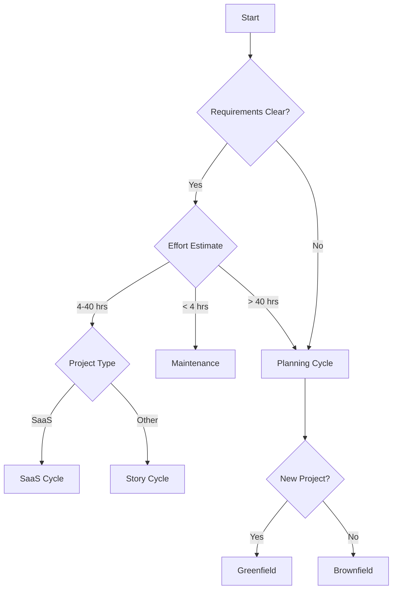

# BMAD-CC Workflows Guide

## Overview

BMAD-CC provides intelligent workflow orchestration that matches work complexity with appropriate process depth. Every workflow is designed to maximize efficiency while maintaining quality.

## Workflow Categories

### Strategic Planning Workflows
For initiatives requiring comprehensive analysis and planning:
- **Planning Cycle** - Multi-phase strategic planning
- **Greenfield Workflows** - New project development
- **Brownfield Workflows** - Existing system enhancements

### Tactical Execution Workflows
For implementation and maintenance:
- **Story Cycle** - Standard feature development
- **SaaS Cycle** - SaaS-specific development
- **Maintenance Cycle** - Quick fixes and improvements

### Intelligent Routing
- **Smart Cycle** - AI-powered workflow selection

---

## Smart Cycle - Intelligent Entry Point

**Command**: `/bmad:smart-cycle`  
**Purpose**: Analyzes requests and routes to optimal workflow

### How It Works

1. **Request Analysis** - Understands what you're trying to achieve
2. **Complexity Assessment** - Estimates effort and scope
3. **Workflow Selection** - Routes to appropriate process
4. **Context Preservation** - Maintains information across phases

### Classification Logic



### Advanced Elicitation

When requirements are unclear:
- Say **"brainstorm"** - Activate creative expansion
- Say **"clarify"** - Use structured elicitation
- Say **"challenge"** - Critical analysis mode
- Say **"explore"** - Alternative approaches

### Examples

```bash
# Simple bug fix
"Login error messages not showing"
→ Routes to: Maintenance Cycle

# New feature
"Add user dashboard with analytics"
→ Routes to: Story Cycle

# Complex initiative
"Build mobile app for our platform"
→ Routes to: Planning Cycle → Greenfield
```

### 🎯 Proper Workflow Invocation Guide

**The Right Way**: Always start with Smart Cycle for intelligent routing

| What Users Often Say (Wrong) | What to Say Instead (Right) | Why |
|------------------------------|----------------------------|-----|
| "Create a component for user profiles" | `/bmad:smart-cycle` → "Add user profile feature" | Smart Cycle routes to correct workflow |
| "Write code for login functionality" | `/bmad:smart-cycle` → "Implement user authentication" | Ensures proper planning and quality gates |
| "Fix this bug quickly" | `/bmad:smart-cycle` → "Login validation error not showing" | Routes to optimized maintenance workflow |
| "Help me design the database" | `/bmad:smart-cycle` → "Design user management system" | Triggers strategic planning if needed |
| "Run planning cycle" | `/bmad:smart-cycle` → "Build mobile app for platform" | Let Smart Cycle decide the right workflow |
| "Create a story for..." | `/bmad:smart-cycle` → "Add analytics dashboard" | Smart Cycle handles story creation routing |

### 🚀 Workflow Trigger Examples

**Direct Commands** (when you know exactly what you need):
```bash
# Only use these if you're certain about the workflow type
/bmad:planning-cycle      # For complex strategic initiatives
/bmad:story-cycle         # For clear feature development
/bmad:maintenance-cycle   # For quick fixes under 4 hours
/bmad:greenfield-fullstack # For new project development
/bmad:brownfield-enhancement # For existing system improvements
```

**Smart Commands** (recommended for most users):
```bash
# Always start here - let AI route your work
/bmad:smart-cycle

# Enhanced elicitation triggers
/bmad:smart-cycle + "brainstorm mobile app features"
/bmad:smart-cycle + "clarify user requirements for dashboard"
/bmad:smart-cycle + "challenge our current auth approach"
/bmad:smart-cycle + "explore alternatives to current architecture"
```

### 💡 Trigger Word Recognition

Smart Cycle recognizes these patterns:

| Pattern | Typical Routing | Example |
|---------|----------------|---------|
| "Fix", "Bug", "Error", "Issue" | Maintenance Cycle | "Fix login error messages" |
| "Add", "Create", "Build" + feature | Story Cycle | "Add user profile dashboard" |
| "Design", "Plan", "Architecture" | Planning Cycle | "Design new mobile architecture" |
| "New project", "From scratch" | Greenfield Workflow | "Build new customer portal" |
| "Enhance", "Improve", "Modernize" | Brownfield Workflow | "Modernize payment system" |
| "Brainstorm", "Explore", "Ideas" | Enhanced Elicitation | "Brainstorm mobile app features" |

### ⚠️ Common Mistakes to Avoid

1. **Don't bypass Smart Cycle** unless you're absolutely certain
2. **Don't give direct implementation instructions** - describe the business need
3. **Don't specify technical details upfront** - let the appropriate agent handle that
4. **Don't mix workflows** - complete one cycle before starting another
5. **Don't skip quality gates** - they prevent expensive rework

---

## Planning Cycle - Strategic Intelligence

**Command**: `/bmad:planning-cycle`  
**Purpose**: Comprehensive planning for complex initiatives

### Workflow Phases



### Phase Details

#### Phase 1: Business Analysis
- **Agent**: Business Analyst
- **Activities**: Market research, competitive analysis, user needs
- **Brainstorming**: What If scenarios, Analogical thinking
- **Output**: `docs/market-analysis.md`

#### Phase 2: Product Strategy
- **Agent**: Product Manager
- **Activities**: PRD creation, feature prioritization, roadmap
- **Brainstorming**: SCAMPER method, Six Thinking Hats
- **Validation**: 8-section checklist, min 8/10
- **Output**: `docs/product-strategy.md`

#### Phase 3: Technical Architecture
- **Agent**: System Architect
- **Activities**: System design, technology selection, API specs
- **Brainstorming**: First Principles, Red Team vs Blue Team
- **Validation**: 10-section checklist, min 8/10
- **Output**: `docs/technical-architecture.md`

#### Phase 4: User Experience
- **Agent**: UX Expert
- **Activities**: User journeys, wireframes, design system
- **Output**: `docs/ux-design-spec.md`

#### Phase 5: Integration
- **Agent**: Product Owner
- **Activities**: Validate alignment, prepare for development
- **Validation**: Master checklist review
- **Output**: Integrated requirements ready for development

### When to Use
- New product development
- Major feature additions
- System redesigns
- When requirements are unclear
- Multi-stakeholder initiatives

---

## Story Cycle - Feature Development

**Command**: `/bmad:story-cycle`  
**Purpose**: Standard development workflow for features

### Workflow Phases



### Phase Details

#### Phase 1: Story Creation
- **Agent**: Scrum Master
- **Activities**: Create story from PRD, define tasks
- **Validation**: Story draft checklist, min 7/10
- **Output**: `docs/stories/epic-X.Y-story-title.md`

#### Phase 2: Development
- **Agent**: Developer
- **Activities**: Implementation, unit tests, integration
- **No-Fallback**: Real data only, no dummy implementations
- **Docker**: All work in containers
- **Task Master**: Update task status

#### Phase 3: Quality Assurance
- **Agent**: QA Engineer
- **Activities**: Code review, testing, performance
- **Dummy Detection**: Scan for fallback patterns
- **Validation**: Story DoD checklist, min 9/10

#### Phase 4: Documentation
- **Agent**: Documentation
- **Activities**: Update docs, API refs, changelog
- **Automated**: CHANGELOG.md updates

#### Phase 5: Learning Extraction
- **Agent**: Learnings
- **Activities**: Extract lessons, best practices
- **Output**: `docs/lessons/story-X.Y-lessons.md`

#### Phase 6: Version Control
- **Agent**: Git
- **Activities**: Commit, push, create PR
- **Task Integration**: Link commits to tasks

### When to Use
- Clear requirements available
- 4-40 hour features
- Standard development tasks
- After planning cycle completion

---

## Maintenance Cycle - Quick Fixes

**Command**: `/bmad:maintenance-cycle`  
**Purpose**: Streamlined workflow for small fixes

### Workflow Phases



### Phase Details

#### Phase 1: Direct Implementation
- **Agent**: Developer
- **Activities**: Root cause analysis, minimal fix
- **Timeframe**: < 4 hours
- **Testing**: Focused unit tests

#### Phase 2: Optional QA
- **Agent**: QA Engineer (if needed)
- **Triggers**: Security-sensitive, high-risk areas
- **Activities**: Quick review, risk assessment

#### Phase 3: Deployment
- **Agent**: Git
- **Activities**: Commit with clear message, deploy
- **Documentation**: Update CHANGELOG.md

### When to Use
- Bug fixes < 4 hours
- Configuration changes
- Documentation updates
- Minor UI adjustments
- Performance tweaks

---

## SaaS Cycle - SaaS Development

**Command**: `/bmad:saas-cycle`  
**Purpose**: SaaS-specific development with Docker

### Additional Features
- Multi-tenant considerations
- API-first development
- Docker health checks
- Service monitoring
- Subscription/billing integration

### Workflow Structure
Similar to Story Cycle with:
- Enhanced Docker integration
- API contract validation
- Multi-tenant testing
- Performance monitoring
- Security validation

---

## Greenfield Workflows - New Projects

**Command**: `/bmad:greenfield-fullstack`  
**Purpose**: Complete new application development

### Workflow Phases

1. **Strategic Planning** (Planning Cycle)
2. **Project Setup**
   - Repository initialization
   - Docker configuration
   - CI/CD pipeline
   - Development environment
3. **Foundation Development**
   - Core architecture
   - Authentication system
   - Basic UI framework
   - Database setup
4. **Feature Development** (Story Cycles)
5. **Launch Preparation**
   - Performance optimization
   - Security hardening
   - Documentation
   - Deployment

### When to Use
- Brand new projects
- No existing codebase
- Need full planning
- Multi-month initiatives

---

## Brownfield Workflows - Enhancements

**Command**: `/bmad:brownfield-enhancement`  
**Purpose**: Existing system improvements

### Workflow Phases

1. **System Analysis**
   - Document existing system
   - Identify integration points
   - Assess technical debt
2. **Enhancement Planning**
   - Create enhancement PRD
   - Design integration strategy
   - Plan migration approach
3. **Incremental Development**
   - Parallel development
   - Feature flags
   - Gradual rollout
4. **Integration Testing**
   - Regression testing
   - Performance validation
   - Compatibility checks

### When to Use
- Adding to existing systems
- Major refactoring
- System modernization
- Integration projects

---

## Workflow Quality Gates

### Entry Gates
Each workflow has entry criteria:

| Workflow | Entry Requirements |
|----------|-------------------|
| Planning | Business need identified |
| Story | PRD exists, requirements clear |
| Maintenance | Issue identified, < 4 hours |
| Greenfield | Project approved, resources allocated |
| Brownfield | System documented, approach defined |

### Exit Gates
Each workflow has completion criteria:

| Workflow | Exit Requirements |
|----------|------------------|
| Planning | All documents validated (8+/10) |
| Story | DoD checklist complete (9+/10) |
| Maintenance | Tests pass, deployed |
| Greenfield | MVP launched, documented |
| Brownfield | Integration complete, regression passed |

### Phase Transitions
Quality gates between phases:



---

## Task Master Integration

### Automatic Task Management

Every workflow integrates with Task Master:

1. **Task Creation**
   - Automatic from PRD parsing
   - Manual for ad-hoc work
   - Linked to epics/stories

2. **Status Updates**
   - `todo` → `in-progress` → `done`
   - Automatic on phase transitions
   - Blocker management

3. **Progress Tracking**
   - Real-time visibility
   - Velocity metrics
   - Burndown charts

### Commands

```bash
# View next task
task-master next

# Update status
task-master set-status --id=123 --status=in-progress

# Create subtasks
task-master expand --id=123 --num=5

# Link to commit
git commit -m "feat: implement auth [task: 123]"
```

---

## Docker Integration

### Container-Based Development

All development happens in Docker:

```bash
# Start environment
docker-compose up -d

# Run tests in container
docker-compose exec backend npm test

# Database operations
docker-compose exec backend npm run migrate

# View logs
docker-compose logs -f backend
```

### Health Monitoring

```bash
# Check health
./.claude/hooks/docker-manager.ps1 health

# Container status
docker-compose ps

# Resource usage
docker stats
```

---

## Workflow Selection Guide

### Decision Tree



### Quick Reference

| Scenario | Recommended Workflow |
|----------|---------------------|
| "Fix login bug" | Maintenance Cycle |
| "Add user profiles" | Story Cycle |
| "Build mobile app" | Planning → Greenfield |
| "Modernize backend" | Brownfield Enhancement |
| "Add billing system" | Planning → SaaS Cycle |
| "Update documentation" | Maintenance Cycle |
| "Redesign architecture" | Planning Cycle |

---

## Best Practices

### Workflow Efficiency
1. Always start with `/bmad:smart-cycle`
2. Trust the routing decision
3. Don't skip quality gates
4. Clear context between phases
5. Use elicitation when unclear

### Common Mistakes to Avoid
- Jumping straight to development without planning
- Using Planning Cycle for simple fixes
- Skipping validation checklists
- Mixing workflow types mid-process
- Ignoring Task Master updates

### Tips for Success
- Let Smart Cycle classify your work
- Use brainstorming techniques in planning
- Maintain Task Master discipline
- Keep Docker containers running
- Review lessons after each cycle

---

*For agent details, see [AGENTS-GUIDE.md](AGENTS-GUIDE.md). For quality gates, see [QUALITY-GATES.md](QUALITY-GATES.md).*